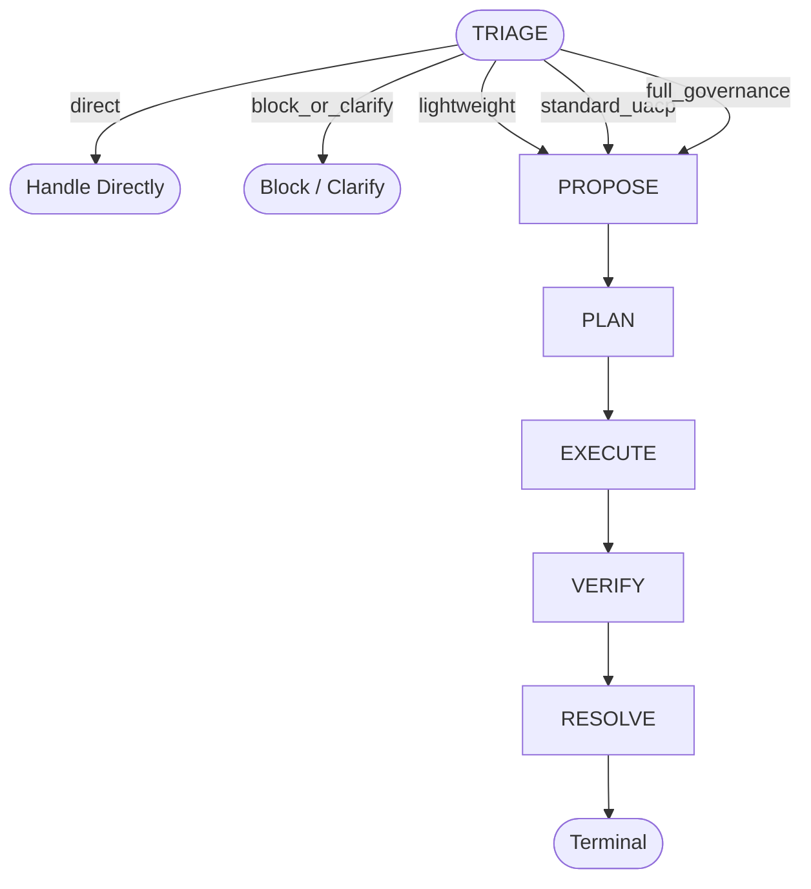
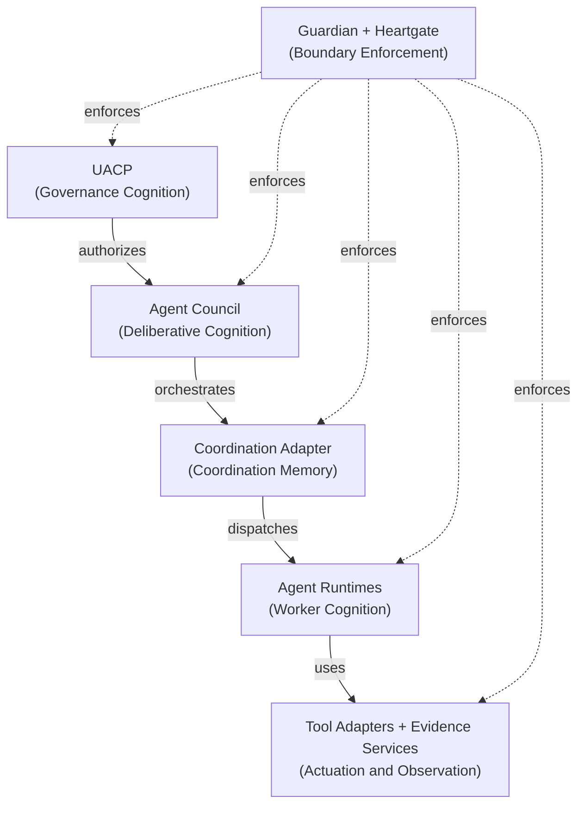

# UACP — Universal Agent Control Plane

UACP is a runtime-neutral governance framework for AI agent work. It provides a staged lifecycle, adaptive evidence selection, multi-agent orchestration, and runtime enforcement — across domains, runtimes, and task types. UACP separates governance (what should happen and under what authority) from deliberation (how to reason about strategy and design) from coordination (tracking durable task state) from execution (bounded work performed by runtimes and tools). This separation is a reasoning invariant, not just a wiring preference: it determines which cognitive plane is authoritative for which class of decision, and prevents category errors from propagating silently through a run.

---

## The Problem UACP Solves

Agent work without governance accumulates hidden assumptions. Authority is implied rather than declared. Side effects are invisible to anything outside the immediate runtime. Phase boundaries are crossed silently — work begins executing before a plan is approved, or resolves before verification evidence exists. Evidence is asserted rather than produced: a runtime reports "done" without anything to back the claim.

UACP makes all of this explicit and enforceable before actions execute. Every phase transition is validated by Heartgate. Every tool call is evaluated by Guardian against declared policy. Every authority delegation is declared in a proposal, not inferred from context. Every evidence obligation is selected adaptively for the run — by domain, risk, reversibility, and artifact type — rather than prescribed by a fixed checklist.

The goal is not to add overhead. It is to ensure that when something goes wrong, the record shows exactly what was authorized, what evidence was produced, and where the boundary was crossed.

---

## Lifecycle

The UACP lifecycle has six phases: **TRIAGE → PROPOSE → PLAN → EXECUTE → VERIFY → RESOLVE**

**TRIAGE** is the entry point. It calibrates scope, scores granularity, and routes the request before any lifecycle commitment is made. Triage can route work directly (bypassing the full lifecycle) or block it pending authority or clarification.

### Triage Routing Outcomes

| Route | Meaning |
|---|---|
| `direct` | No governed lifecycle. Handle directly without phase tracking. |
| `lightweight` | Minimal governed path with a small artifact footprint. |
| `standard_uacp` | Normal lifecycle at standard governance intensity. |
| `full_governance` | Full lifecycle with Agent Council, broader review, and durable learning. |
| `block_or_clarify` | Stop. Require authority or clarification before proceeding. |

The `lightweight`, `standard_uacp`, and `full_governance` routes all enter PROPOSE and continue through the linear chain. Evidence inside each phase is adaptive — selected by context — not a fixed checklist applied uniformly.



### Phase Responsibilities

| Phase | Responsibility |
|---|---|
| TRIAGE | Scope calibration, granularity scoring, governance routing |
| PROPOSE | Declare intent, authority, constraints, and evidence obligations |
| PLAN | Produce a verified, council-reviewed execution plan |
| EXECUTE | Perform bounded work through runtimes and tools within Guardian policy |
| VERIFY | Produce and synthesize evidence that the plan was executed correctly |
| RESOLVE | Close the run, record lessons, and release all held state |

---

## Cognitive and Control-Plane Model

UACP enforces a strict separation between five cognitive/operational planes, plus a boundary-enforcement layer. Mixing planes causes category errors: do not use a Coordination Adapter to decide policy; do not use Agent Council as a durable state database; do not let worker runtimes silently change UACP phase state.



### Plane Definitions

| Plane | Role | Examples |
|---|---|---|
| UACP | Governance cognition: should / may / must / under what risk | This repository |
| Agent Council | Deliberative cognition: think together / design / challenge / synthesize | Role-diverse agents configured per run |
| Coordination Adapter | Coordination memory: remember / coordinate / track / hand off | Kanban, issue trackers, custom queues (replaceable) |
| Agent Runtimes | Worker cognition: reason locally / perform bounded work | Hermes, Claude Code, Codex, OpenCode, Kimi, Gemini |
| Tool Adapters + Evidence Services | Actuation and observation: observe / act / produce evidence | Web search, browser automation, scraping APIs |
| Guardian + Heartgate | Boundary enforcement: enforce the separation between all other planes | Guardian (tool calls), Heartgate (phase transitions) |

The Coordination Adapter is intentionally replaceable. Kanban is the current implementation, not the required one. What is required is that durable task state flows through a declared adapter and is not held privately by any runtime.

---

## Key Concepts

| Concept | Definition |
|---|---|
| Triage | Scope calibration, granularity scoring, and governance routing before committing to a full run |
| Phase | One stage of the lifecycle; evidence requirements are adaptive per phase, not fixed globally |
| Granularity | Governance complexity of a run or phase; phase-local and compositional — each phase scores itself, rather than inheriting a single flat number assigned at intake |
| Guardian | Runtime tool-call enforcement engine; evaluates normalized events against policy before actions execute |
| Heartgate | Lifecycle transition validator; ensures phase boundaries are truthful and all invariants satisfied before permitting forward movement |
| Agent Council | Multi-agent deliberative primitive: role-diverse agents reason, challenge, and synthesize; review is one mode among many (plan, execute, audit, research, brainstorm, resolve) |
| Coordination Adapter | Replaceable durable task substrate used by EXECUTE for multi-worker coordination; Kanban is an example implementation |
| Runtime Adapter | Runtime-specific plugin that translates runtime events into normalized Guardian and Heartgate contracts; thin and policy-free |
| Evidence Cluster | A context-selected set of evidence obligations for one phase |
| Policy Pack | A bundle of Guardian policy for a specific governance context |

---

## Repository Layout

```
uacp/
├── README.md                          ← you are here
│
├── docs/                              ← canonical prose authority
│   ├── index.md                       ← document registry and read order (start here as an agent)
│   ├── constitution.md                ← non-waivable invariants
│   ├── lifecycle-reference.md         ← phases, granularity, state, skill contracts
│   ├── orchestration-model.md         ← Agent Council, tiers, roles, execution profiles
│   ├── runtime-enforcement.md         ← Guardian and Heartgate design
│   ├── runtime-porting-and-version-control.md  ← adapter ownership and version-control policy
│   ├── alignment-spec.md              ← artifact root layout and generic alignment conventions
│   ├── runtime-integration-guide.md   ← how to integrate a new runtime
│   ├── first-principles.md            ← reasoning principles behind UACP
│   └── decision-log.md                ← durable record of major decisions
│
├── config/                            ← machine-readable policy derived from docs
│   ├── evidence-clusters.yaml
│   ├── gate-selection.yaml
│   ├── guardian-policy.yaml
│   ├── memory-policy.yaml
│   ├── phase-transitions.yaml
│   ├── review-routing.yaml
│   ├── roots.yaml
│   ├── runtime-bindings.yaml
│   ├── state.yaml
│   └── version-control.yaml
│
├── state/                             ← mutable runtime state (mutated only through uacp-state)
│   ├── current.yaml                   ← active run pointer and phase
│   ├── kanban.yaml                    ← coordination adapter state
│   └── runs/                          ← per-run state records
│
├── proposals/                         ← PROPOSE phase artifacts
├── plans/                             ← PLAN phase artifacts
├── executions/                        ← EXECUTE phase records
├── verification/                      ← VERIFY evidence and council synthesis artifacts
├── outputs/                           ← final outputs and operational dashboards
│
├── knowledge/                         ← reusable scenarios, templates, lessons, indexes
│   ├── gate-templates/
│   ├── indexes/
│   ├── lessons/
│   └── scenarios/
│
├── runtime-adapters/                  ← UACP-owned adapter source per runtime
│   └── hermes/
│
└── scripts/                           ← diagnostic and probe scripts
    ├── live_guardian_probe.py
    └── validate_uacp_artifacts.py
```

`docs/` is the authority layer. `config/` is derived from `docs/`. `state/` is the only mutable layer during a run. Everything else is append-only artifact storage.

---

## Where To Start

**As a human reading this for the first time:**
`README.md` → `docs/policy/constitution.md` → `docs/lifecycle/lifecycle-reference.md` → `docs/lifecycle/orchestration-model.md`

**As an agent executing UACP work:**
`docs/INDEX.md` is the canonical read order. Start there. It specifies which documents to load in which sequence for a given run type.

**To integrate a new runtime:**
`docs/runtime/runtime-integration-guide.md` — defines the adapter contract, normalization requirements, and Guardian/Heartgate integration points.

**To understand runtime enforcement (Guardian / Heartgate):**
`docs/runtime/runtime-enforcement.md` — covers the enforcement model, event normalization, policy evaluation order, and failure modes.

**To understand design history and major decisions:**
`docs/decisions/decision-log.md` — durable record of decisions that shaped the current design, including alternatives considered and why they were rejected.

---

## Authority Chain

When a conflict exists between layers, earlier layers win. An explicit entry in `docs/decisions/decision-log.md` is the only mechanism to override this order.

| Priority | Layer | Role |
|---|---|---|
| 1 | `docs/INDEX.md` | Document registry and canonical read order |
| 2 | Canonical prose docs (`docs/`) | Intent, principles, lifecycle, and policy |
| 3 | YAML config (`config/`) | Machine-readable rules derived from docs |
| 4 | Runtime state (`state/`) | Current lifecycle position and run pointers |
| 5 | Skills and runtime behavior | Implement the documented rules |
| 6 | Execution artifacts | Record what happened in a specific run |

Skills and runtimes do not override docs. Config does not override docs. If a YAML rule contradicts a prose document, the prose document is authoritative and the YAML must be corrected.

---

## Runtime Support

UACP is designed to be runtime-neutral. The current host runtime is **Hermes**. Planned future runtimes: Claude Code, Codex, OpenCode, Kimi, Gemini.

Each runtime requires a thin adapter that translates runtime-specific events into normalized Guardian and Heartgate contracts. The adapter is policy-free: it translates events but does not evaluate them. UACP-owned adapter source lives under `runtime-adapters/<runtime>/`.

See `docs/runtime/runtime-integration-guide.md` for the full integration contract, including required event schema, normalization rules, and Heartgate handshake protocol.
