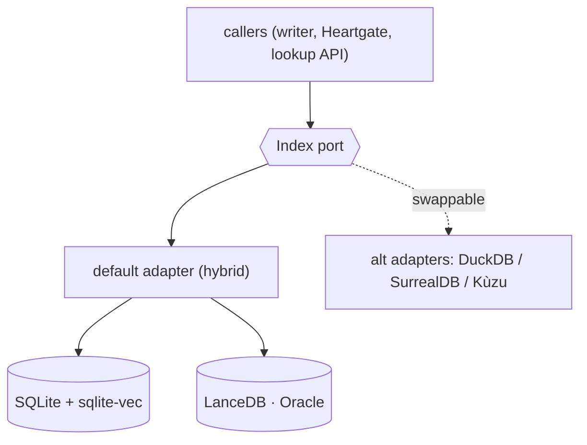

# Projection & Lookup (pattern)

> ⚠️ **PARTIALLY SUPERSEDED by D29/D20 (final-review T1/T2).** The **closure-check model** (orphan/
> phantom/uncovered/unverified/…) and the projection *concept* are current and validated by the spike.
> But for **v1**: there is **NO SQLite, NO recursive-CTE, NO Index port** — the projection is an
> **in-memory dict** (D20); `sqlite-vec`/SQLite are deferred (D29). Read the `## Build`, `## Substrate`,
> and `## The Index port` sections as **deferred/historical**, not v1 contract. Also: closure checks split
> into **structural (always-block)** vs **progress/`unverified` (phase-gated)** — see D26/T2.

The engine is a **pure projection**: load all node/edge serializations → one graph → query.
Same artifacts in, same graph out. It is a read-model, not a source of truth.

## Build (deserialize)

Generalize the existing precedent — `engines/oracle/index_build.py` already loads a directory of OKF
files into rows. Extend that pattern from knowledge-only to all planes:

1. Walk each phase aggregate (`proposals/`, `plans/`, `executions/`, `verification/`,
   `knowledge/`...).
2. For each node file: parse frontmatter → a `nodes` row `(id, kind, run_id, path, ...)`.
3. For each serialized edge (frontmatter keys + `_index.yaml` edges): an `edges` row
   `(src, dst, rel_type, provenance)`.
4. Upsert into SQLite. No embeddings touch an edge.

```sql
CREATE TABLE nodes (id TEXT PRIMARY KEY, kind TEXT, run_id TEXT, path TEXT);
CREATE TABLE edges (src TEXT, dst TEXT, rel_type TEXT, provenance TEXT);
```

SQLite is "an existing relational structure" — recursive CTEs give graph traversal with zero new
infra (see [02-decisions](02-decisions.md) D2). The same tables export to a graph DB unchanged.

## Substrate (D11) — two indexes, one source of truth

> **SUPERSEDED by D16/D21/D27:** truth = the **per-node files** (D21; `_index.yaml` and SQLite are both
> derived, neither authoritative). There is **one** SQLite holding edges + sqlite-vec + FTS5 (D16 — not
> two stores), and the SQLite substrate + Index port are **deferred from v1** (D20 — v1 uses an in-memory
> dict projector). The two-store table below is **historical context only**. See
> [19-storage-summary](19-storage-summary.md).

YAML-OKF stays the **source of truth**; databases are **derived indexes**, split by plane:

| Plane | Substrate | Why |
|---|---|---|
| relation (deterministic edges) | **SQLite + recursive CTE** | small DAG-ish graphs (tens–hundreds of nodes/run); embedded, zero-infra; rebuildable cache |
| semantic (entry resolution, inferred edges) | **LanceDB** | vector + FTS; already the Oracle substrate, locked. Cannot do FK traversal — different job |

A **native graph DB** (SurrealDB/ArcadeDB) is **not** adopted in v1: at this scale recursive SQL wins,
and a new runtime dependency fights the embedded/zero-infra/cross-runtime constraint (ArcadeDB's JVM
especially). **Reconsider only at Slice 3**, where the code-plane symbol graph (100k+ nodes, dense
cyclic edges) could make native path queries — or a unified graph+vector engine — worth the dependency.
As-is, manifests have **no index at all** (plain-filesystem globbing); this projection is the upgrade.

## Two-way lookup

Semantic touches the graph in exactly one place — **entry resolution**. After that, traversal is
pure FK-walk.

- **Forward (semantic/business → structure).** Resolve a fuzzy concept ("login") to an entry node
  *once* (the only semantic step), then **descend** deterministically through
  `asserted`/`derived`/`parsed` edges to every work_unit, checkpoint, code symbol, test. Output: the
  full subgraph of "everything login becomes."
- **Reverse (code/task → intent).** Start at a `work_unit` (or, Slice 3, a `code_symbol`) and
  **ascend** — no search at all — checkpoint → work_unit → scope_item → intent. Output: "why does this
  exist / what authorized it."

```sql
-- reverse: from a node up to its originating intent
WITH RECURSIVE up(id) AS (
  SELECT :start
  UNION
  SELECT e.dst FROM edges e JOIN up ON e.src = up.id
  WHERE e.provenance IN ('derived','asserted','parsed')   -- hard edges only
)
SELECT n.* FROM nodes n JOIN up ON n.id = up.id;
```

Filter `provenance` to toggle deterministic-only vs. include-advisory. v1 is **lookup, not
synthesis** — it returns subgraphs and provenances; it never generates an interpretation.

## Integrity report (closure checks)

Pure set-algebra over ids — deterministic, no model. These are the checks that kill the original
symptoms:

| check | definition | catches |
|---|---|---|
| `orphan` | node missing a required parent edge | unanchored work |
| `phantom` | an edge endpoint that resolves to no node | invented references |
| `uncovered` | a scope_item with no inbound `derives_from` | dropped intent |
| `unverified` | a work_unit with no `assessment` | silent skips |
| `skipped-but-claimed` | `assessment.result: pass` with no backing checkpoint/evidence id | false "done" |

Run against **today's** fixtures, the `uncovered`/`orphan` checks flag every PROPOSE→PLAN link
automatically — the engine self-demonstrates the seam before any schema change lands.

## Transition handling (report-only, no inference)

While scope_items still lack ids, the projector emits the `scope_item → work_unit` edge **only when a
`derives_from` key exists**. Where absent, it reports `uncovered` and stops. It **never** semantically
guesses the linkage. The honesty is enforced by construction: an edge exists iff someone serialized a
key.

## Where it lives

A new `graph_projection` engine registers beside the existing read-only engines
(`evidence_completeness`, `scope_conformance`, `coherence`, ...) in `engines/__init__.py` and is
invoked by the same `run_all_engines` path. No new wiring.

## The `Index` port (abstraction over the backends) — D14

The rest of the system never touches SQLite or LanceDB directly; it depends on one **`Index` port**:

```
Index (port)
  sync(changed_files)              # project files → backends (incremental; full build = sync(all))
  resolve(text)  -> [node_id]      # fuzzy entry resolution         (vector)
  search(text, filters) -> hits    # fuzzy search, reranked          (vector + FTS)
  walk(id, direction, provenance)  # exact multi-hop traversal       (recursive CTE)
  lookup(text)   -> subgraph       # HYBRID: resolve ∘ walk (the forward flow)
```

- **Default adapter** composes the hybrid: SQLite(+sqlite-vec) for exact links + entry/code vectors;
  LanceDB for the Oracle corpus. Callers issue `lookup("login")` and never know which backend served what.
- **Swappable:** DuckDB-over-files, SurrealDB, Kùzu/Ladybug all implement the same port — the substrate
  choice becomes a localized adapter swap, not a caller change.
- **Boundary:** the Index adapter is the ONLY component touching a backend → keeps "files = truth,
  indexes = derived" enforceable.
- **On top, not inside:** the closure checks above are *queries via the port*, consumed by Heartgate —
  not part of the Index. Lives in `uacp-core`; depends on `uacp-schema` (leaf).

