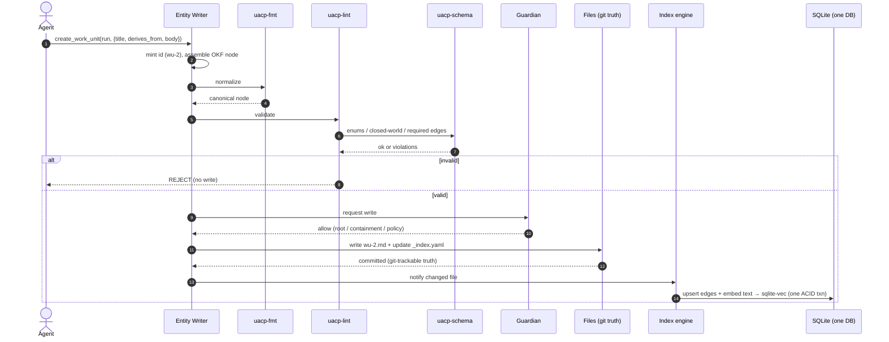
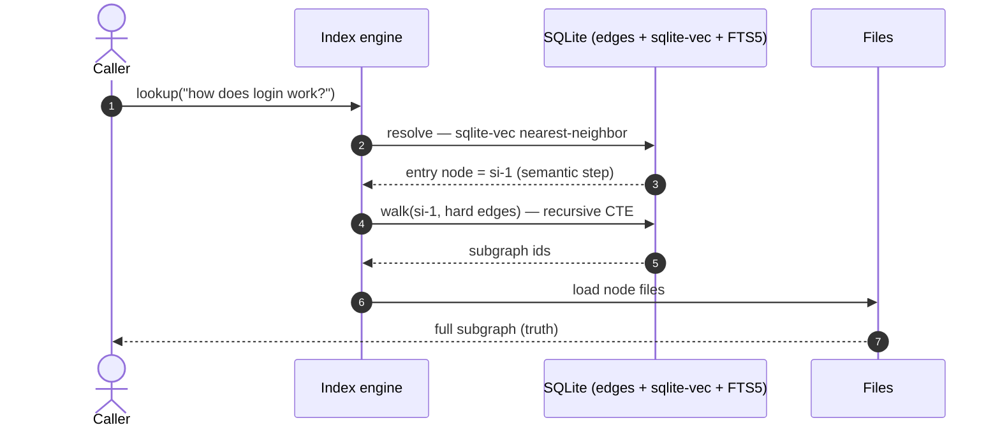
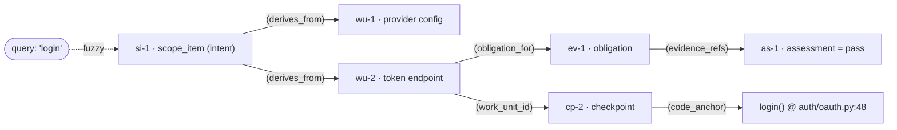
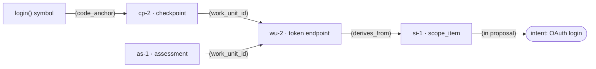
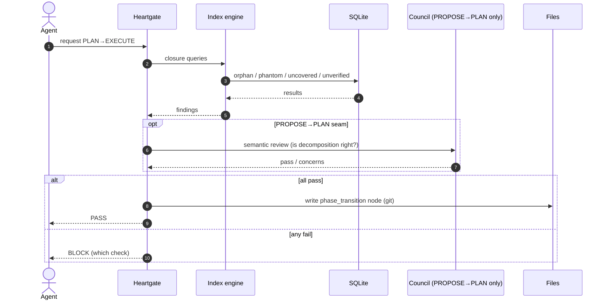
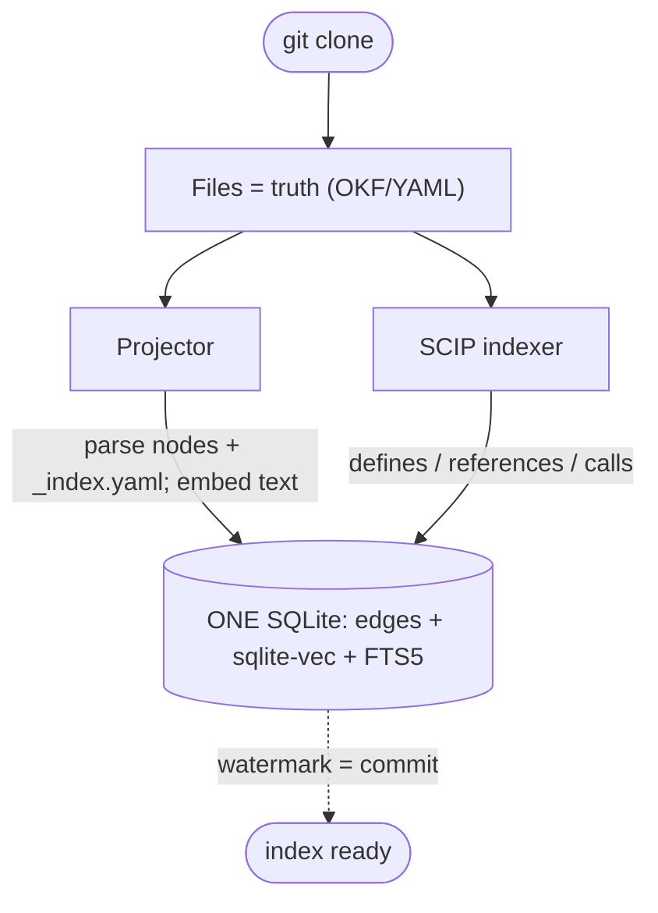
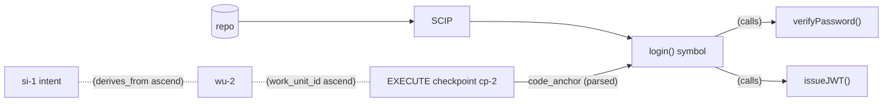
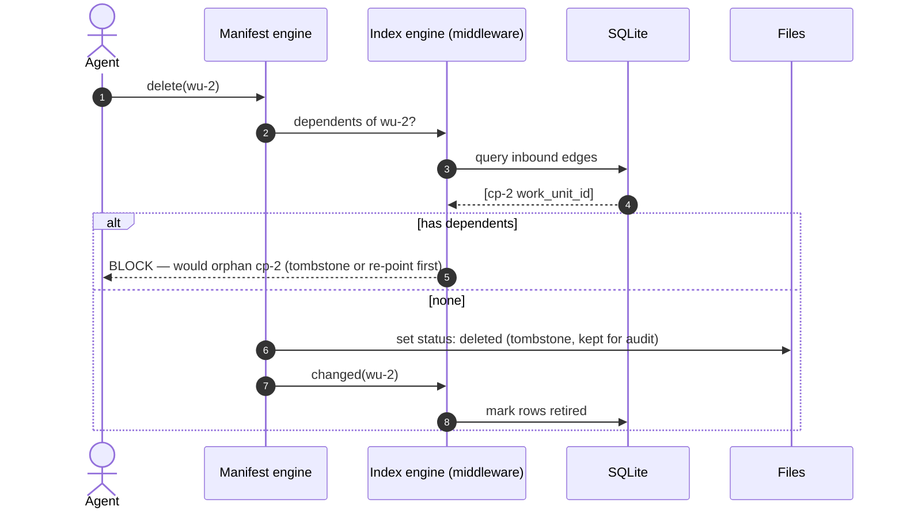
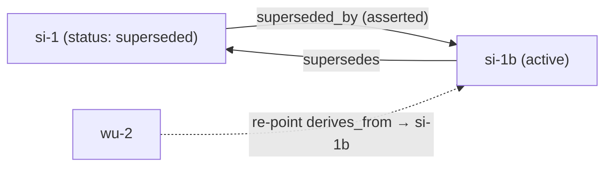

# Operational Flows (the drill)

> ⚠️ **SUPERSEDED in part by D29 (final-review T1).** The flow *shapes* (write/lookup/transition/rebuild,
> CRUD, end-to-end trace) are current — but every mention of "one SQLite (sqlite-vec + FTS5)" / the Index
> engine is **historical single-DB framing**. In v1 the structural store is **plain YAML files + an
> in-memory projection (no database)**; the "Index engine" is just the in-memory projector. See D29/D20.

One line: **agents read/write *files* through validated governed calls; one SQLite index (edges +
sqlite-vec + FTS5), reached only via the Index engine, makes lookup fast; git versions the files; the
DB rebuilds from them.**

> **Diagram legend.** In the graph walks, **arrows show traversal direction** and the `(rel)` label is
> the stored edge key. Foreign keys are physically stored **child → parent** (`wu --derives_from--> si`,
> `cp --work_unit_id--> wu`); the recursive CTE walks them in **either** direction (ascend or descend).
> **`DB` is one SQLite** holding edges + `sqlite-vec` vectors + `FTS5` — exact walk and fuzzy search hit
> the *same* file; the **Index engine** is the only thing that touches it (D14/D16). The Index engine
> (the wrapper) is **defined** in [14-projection-engine](14-projection-engine.md); these flows only
> **use** it — single source, they don't redefine it.

---

## 1. WRITE — create/update a node



The agent supplies domain data only — never a path, id, or DB row.

---

## 2. READ (forward) — fuzzy concept → structure (multi-hop descend)

One SQLite serves both steps; the Index engine resolves (sqlite-vec) then walks (CTE):



The vector resolve is the **only** semantic step; the walk is exact — and both are the same DB.

The multi-hop walk it returns:



---

## 3. READ (reverse) — task/code → intent (multi-hop ascend, no search)



Pure FK walk over the one SQLite — no vector step at all. Filter `provenance` for hard-only (proven)
vs include inferred (advisory). v1 returns the subgraph + provenances; it does **not** synthesize.

---

## 4. TRANSITION — e.g. PLAN → EXECUTE



Two gates only meet at PROPOSE→PLAN: structural closure (Heartgate, over the DB) **and** judgment (council).

---

## 5. REBUILD — fresh clone / lost index



One DB to rebuild; nothing is lost — the index was never a record.

---

## 6. CODE-PLANE (Slice 2) — connecting reality



SCIP's symbol nodes + edges land in the **same** SQLite as the manifest edges. Once the checkpoint
records `code_anchor`, the reverse drill runs end to end: `login()` → cp-2 → wu-2 → si-1 → intent.

---

## 7. EDIT — update in place (same id)

```mermaid
sequenceDiagram
    autonumber
    actor Agent
    participant ME as Manifest engine
    participant MW as Index engine (middleware)
    participant FS as Files (git)
    participant DB as SQLite
    Agent->>ME: edit(wu-2, {new body / re-point derives_from})
    ME->>ME: fmt + lint(schema) — SAME id
    ME->>FS: rewrite wu-2.md (git diff shows exact change)
    ME->>MW: changed(wu-2)
    MW->>DB: re-sync node + edges; re-embed text
    MW->>DB: closure re-check (did the edit orphan anything?)
    DB-->>MW: ok / findings
```

Identity is preserved → inbound edges (`cp-2 → wu-2`) stay valid. Only the node's own content/outbound
edges change; the middleware re-syncs and re-checks closure.

## 8. DELETE — tombstone, never silent orphaning



Hard-delete of a node with dependents is **blocked** by closure (it would create phantoms). Default is a
**tombstone** (`status: deleted`, retained) — git keeps history regardless.

## 9. SUPERSEDE — replace with lineage


```mermaid
sequenceDiagram
    autonumber
    actor Agent
    participant ME as Manifest engine
    participant MW as Index engine (middleware)
    participant FS as Files
    Agent->>ME: supersede(si-1 → si-1b)
    ME->>FS: create si-1b (active); si-1 status=superseded; add supersedes / superseded_by
    ME->>FS: re-point children (derives_from si-1 → si-1b)
    ME->>MW: changed(si-1, si-1b, children)
    MW->>MW: closure — no dangling refs to si-1; lineage intact
```

The old node is **kept** (not destroyed) and the supersession is a first-class, queryable fact —
"what replaced si-1, and why" is just a `supersedes` edge walk. (See [02-decisions](02-decisions.md) D18.)

## Consistency

The one SQLite carries a **source watermark** (commit/content hash). Stale → rebuild. One ACID store →
**no cross-store transaction** (D16); truth is the files. (See [19-storage-summary](19-storage-summary.md), [02-decisions](02-decisions.md) D13/D16.)
