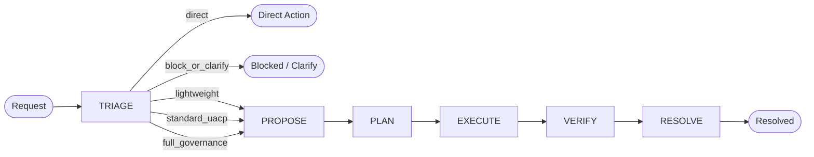

# UACP Lifecycle Reference

UACP governs work through a triage entry stage followed by a stable five-phase lifecycle:

```text
TRIAGE -> PROPOSE -> PLAN -> EXECUTE -> VERIFY -> RESOLVE
```

Triage decides whether the request should enter UACP at all, at what governance intensity, and whether immediate human involvement is required. Each later phase transition runs adaptive gate selection before deciding whether to proceed.

For high-granularity governance-core admission work, TRIAGE must not be silently compressed into PROPOSE. When TRIAGE estimates phase-local or composite granularity at 7 or higher, or when the request touches Agent Council, Heartgate, Guardian, lifecycle semantics, artifact schema, runtime enforcement, or protected state, TRIAGE should select a phase-local Agent Council focused only on admission/routing/scope/granularity. A TRIAGE-local council does not replace PROPOSE council; PROPOSE council remains responsible for authority, side effects, proposal quality, and artifact contract review. When selected, TRIAGE→PROPOSE should record council synthesis and Heartgate transition coherence before PROPOSE artifacts are treated as adopted.

Human involvement may be selected by TRIAGE or by later phase-local reassessment when authority, side effects, granularity, unresolved findings, or Guardian/Heartgate uncertainty require it.

## Lifecycle Flow



Evidence inside each phase is adaptive. Gate selection runs before each phase transition to choose required, optional, not-applicable, or generated evidence clusters based on domain, risk, reversibility, and artifact type.

## Orchestration And Council Routing

UACP phases may invoke Agent Council as a runtime-neutral multi-agent orchestration primitive. The canonical vocabulary for council modes, council tiers, runtime adapters, roles, diversity dimensions, and deep-* compatibility lives in `docs/orchestration-model.md`.

Granularity and council tier are separate axes:

- UACP granularity is the end-to-end governance complexity of the whole request or proposal.
- Council tier is the orchestration depth selected for one council invocation.

TRIAGE derives request granularity and may recommend a default council tier. Later phases may override that default when the specific evidence need is narrower or broader than the overall run.

Council outputs are phase evidence. They do not replace phase artifacts, Guardian/Heartgate checks, or the document authority chain.

### Council Follow-Through Gate

When a phase-local Agent Council, Heartgate Council, evidence cluster, invariant check, or transition review returns blockers, concerns, invariant failures, negative findings, or material warnings, those findings must not silently become a pass after being handled.

Material findings marked `remediated`, `expanded`, or `justified` require a traceable handling artifact and context-selected follow-up Agent Council review before phase progression. Findings marked `deferred`, `accepted_warning`, or `rejected_with_reason` require Heartgate visibility, owner, residual risk, and next-phase obligation; follow-up council is selected when severity, risk, or routing requires it.

The follow-up council synthesis is evidence for Heartgate, not transition approval. Heartgate independently validates transition coherence and may still block. Default follow-up recursion is capped at one rerun; if the follow-up council creates a new blocker or material concern, the transition blocks or escalates instead of spawning endless councils.

### Phase-local Council vs Heartgate Council

UACP distinguishes two council responsibilities:

- **Phase-local Agent Council** checks the work inside a phase: artifact quality, implementation correctness, role-specific risks, evidence quality, and local consistency with the phase plan. It answers: *did this phase team do its work properly?*
- **Heartgate Council** checks the phase boundary: whether the completed phase truthfully satisfies its lifecycle contract and whether the next phase is receiving a coherent state. It answers: *is this transition legitimate, consistent, and safe?*

The Heartgate Council is not a duplicate code review. It performs lifecycle coherence and cross-artifact consistency checks across doctrine, proposal/plan, state, runtime behavior, verification evidence, carried warnings, and next-phase obligations.

For non-trivial runtime/governance work, phase transitions should include both: phase-local council synthesis as evidence, and Heartgate-level transition coherence before accepting the move. For low-risk reversible work, Heartgate may perform the coherence checklist without a separate council fan-out.

Artifact separation rule:

- Phase-local Agent Council outputs use `kind: uacp.council_synthesis`, live under `verification/`, and are referenced from transition artifacts by `council_synthesis_artifact`.
- Heartgate/transition coherence evidence lives under `verification/` and is referenced from transition artifacts by `heartgate_coherence.artifact_path`.
- A single artifact may cover both roles only when it explicitly states the dual scope and includes the required Heartgate lenses; otherwise phase-local council synthesis and Heartgate coherence are separate artifacts.
- Recommended naming: `verification/<run-or-topic>-<phase>-council-synthesis-<date>.yaml` for phase-local councils and `verification/<run-or-topic>-heartgate-coherence-<date>.yaml` for transition coherence. Existing legacy artifacts may have older names but new artifacts should prefer this pattern.

VERIFY uses a finding-driven pattern when council review, audit, research, or validation is selected. Findings must identify severity, evidence, affected artifact, recommended action, owner/disposition, and state. Phase closure depends on whether findings are resolved, accepted as explicit residual risk, deferred with owner/condition, or blocking.


## Phase-Local Granularity

Granularity is not only a single run-level number. Each phase may carry its own phase-local granularity score, and the run's composite granularity is derived from those phase scores plus cross-phase coupling.

TRIAGE records an initial estimate for the whole request and likely phase hotspots. PROPOSE, PLAN, EXECUTE, VERIFY, and RESOLVE revise their own phase-local granularity as evidence changes. This prevents a simple intake from hiding a complex implementation or verification phase.

Each phase should record:

- `entry_estimate`: expected phase-local granularity at phase start.
- `exit_actual`: observed phase-local granularity at phase end.
- `delta_reason`: why the score changed materially, if it changed.
- `downstream_projection`: updates to expected complexity for later phases.

Composite granularity should consider the maximum phase score, accumulated phase scores, unresolved findings carried forward, side effects, runtime/domain diversity, and coupling between phases. Composite granularity should be recalculated after each phase exit so downstream phases inherit the best current estimate.

## TRIAGE

Purpose: calibrate scope, assign a granularity level, and route the request.

Typical routing outcomes:

- direct
- lightweight
- standard_uacp
- full_governance
- block_or_clarify

Typical artifacts:

- triage summary for Level 2+ work
- scoring factors: impact, reversibility, domain count, runtime count, verification difficulty
- initial composite granularity estimate
- phase-local granularity estimates or hotspots when visible
- routing outcome
- initial domains and artifact types
- authority, side-effect, and trust-boundary notes

Exit condition: request is routed to direct action, blocked for clarification, routed to human involvement, or admitted into `PROPOSE`. TRIAGE can terminate without entering PROPOSE when the routing outcome is `direct` or `block_or_clarify`.

Phase transition artifacts use `routing_outcome` and `terminal_kind` with aligned vocabulary: `direct`, `lightweight`, `standard_uacp`, `full_governance`, and `block_or_clarify`; `terminal_kind: none` is used for non-terminal transitions.

Triage admission map:

| Outcome | Disposition |
|---|---|
| `direct` | No UACP lifecycle; handle directly with a lightweight record only when needed. |
| `lightweight` | Enter a minimal governed path with a small artifact footprint. |
| `standard_uacp` | Enter the normal UACP lifecycle at standard governance intensity. |
| `full_governance` | Enter the full lifecycle with councils, broader review, and durable learning. |
| `block_or_clarify` | Stop and request clarification or authority before proceeding. |

## PROPOSE

Purpose: define the requested work, authority, scope, affected domains, side effects, and risk.

Typical artifacts:

- proposal summary
- initial gate-selection artifact
- scope and non-goals
- authority and side-effect declaration

Exit condition: proposal is approved or explicitly blocked.

## PLAN

Purpose: transform the approved proposal into bounded execution, selected evidence clusters, review routing, and verification strategy.

Typical artifacts:

- execution plan
- Kanban task graph description
- selected PLAN clusters
- verification candidates
- write containment plan

Exit condition: execution can start with clear boundaries and acceptance evidence.

## EXECUTE

Purpose: perform bounded work through Hermes Kanban, Agent Council execution topology, delegated workers, external coding agents, or local tools as selected.

For non-trivial implementation, EXECUTE should treat Agent Council as the preferred orchestration layer. Kanban stores durable tasks and dependencies; Agent Council defines the role-aware worker topology, critique loops, fan-out/fan-in, and synthesis needed to implement safely. Single-agent/local-tool execution remains valid for direct or lightweight work where council overhead would not improve safety or quality.

Cognitive responsibility during EXECUTE must remain explicit: UACP authorizes and gates, Agent Council deliberates and synthesizes when selected, Kanban persists coordination state, and runtimes/tools perform bounded work.

Execution topology composes four layers: UACP lifecycle authority, Agent Council orchestration when selected, Hermes Kanban as durable task substrate, and selected agent runtimes/tool adapters/evidence services for bounded work. Browser automation, Puppeteer/Playwright, computer use, Firecrawl, Tavily, SearXNG, web search, and scraping APIs are execution/evidence surfaces governed by PLAN and Guardian policy; they are not automatically agent runtimes.

Typical artifacts:

- execution history
- changed artifact list
- worker reports
- side-effect log

Exit condition: planned execution units are complete or explicitly blocked.

## Coordination Adapter Binding

A coordination adapter is a replaceable durable task substrate, not the UACP lifecycle state machine. The adapter stores task graphs, dependencies, ownership, status, and handoff state. UACP records phase state in UACP artifacts; the adapter provides execution traceability through task IDs.

The current coordination adapter is Hermes Kanban. Its confirmed semantics:

- storage is SQLite-backed and board-scoped,
- boards can isolate unrelated streams of work,
- task statuses are `triage`, `todo`, `ready`, `running`, `blocked`, `done`, and `archived`,
- parent links gate child tasks: children stay `todo` until all parents are `done`, then promote to `ready`,
- the dispatcher claims `ready` tasks with assignees and spawns worker profiles,
- workers complete, block, heartbeat, comment, or create follow-up tasks through Kanban tools,
- workspaces are declared as `scratch`, `dir`, or `worktree`,
- completion summaries and metadata are the structured handoff surface.

UACP must not assume the coordination adapter knows UACP phases. UACP phase state must be recorded in UACP artifacts, while adapter task IDs provide execution traceability.

Do not conflate:

- UACP `TRIAGE`: governance entry stage for scope calibration and routing.
- Coordination adapter task status (e.g., Hermes Kanban `triage`): status for an underspecified task card that needs specification before it becomes `todo`. This is not a UACP lifecycle phase.

When UACP binds PLAN and EXECUTE to a coordination adapter, it records:

- board slug,
- root task IDs,
- parent-child task graph,
- assignee/profile,
- workspace kind and path policy,
- completion summaries and metadata needed for VERIFY.

Active binding:

- `state/kanban.yaml` is the current binding artifact.
- `board_slug` is `uacp`.
- `root_task_ids` records the current binding anchor task ids for PLAN/EXECUTE traceability.
- `state/current.yaml` may point at the binding artifact for fast retrieval.

## State And Version-Control Design

UACP has an explicit state layer. The current implementation is file-based YAML with governed mutation routed through `uacp-state`.

Design decision:

- UACP has an initial `state/` layer.
- Active lifecycle state should be file-based YAML first, not SQLite first.
- SQLite or a standalone service can be added later for query, concurrency, or ranking needs.
- Git should version governance docs, config, schemas, tombstones, and durable audit artifacts.
- Runtime state changes should not require a git commit for every mutation.
- Historical audit artifacts should be append-only where practical.

State file shape should be small and pointer-based. A run manifest should record:

- run id,
- current UACP stage or phase,
- phase-local granularity scores and current composite granularity when available,
- authority source,
- selected artifact paths,
- current transition artifact,
- council synthesis artifact when a checkpoint is reviewed,
- current phase transition artifact,
- selected evidence clusters,
- Kanban board slug and task IDs when Kanban is used,
- verification status,
- deferred items,
- latest update provenance.

During bootstrap, `current_stage` and `current_phase` had to match exactly. They remain aliases until `uacp-state` introduces a single canonical field or a strict derivation rule.
The bootstrap boundary is closed. `state/current.yaml` records `mutation_policy: uacp_state_required`, `bootstrap_closed: true`, and `governed_mutation_active: true`.

State mutation rule:

- Runtime state mutation goes through the dedicated `uacp-state` skill.
- Direct state edits are closed bootstrap behavior and require explicit recovery authorization if needed.
- Every state change must point to an authorizing artifact or phase transition.
- State must reference artifacts by `UACP_ROOT`-relative paths or symbolic roots, not physical deployment paths.

Version-control binding:

- `UACP_ROOT` is versioned as its own focused repository for UACP governance and durable audit artifacts.
- `HERMES_ROOT` may bind and host UACP, but should not be the implicit source of truth for UACP history unless explicitly chosen.
- Tombstone `git_commit` should point to the commit that deleted the legacy file and added or updated the tombstone. Agents can retrieve the deleted content from that commit's parent at the `deleted_path`.
- When no repository exists, tombstones use `unavailable-no-git-worktree` and must be updated after versioning is established.

Boundary definitions:

- Canonical governance: active docs and config listed in `docs/index.md`.
- Runtime state: current lifecycle position, current pointers, and run manifests under `state/`.
- Historical audit: proposals, plans, executions, verification artifacts, outputs, lessons, and tombstones.
- Knowledge artifacts: reusable scenarios, templates, lessons, and indexes under `knowledge/`, later eligible for Knowledge Bank ingestion.

Active implementation:

- `uacp-state` exists and owns governed runtime-state mutation.
- The lifecycle skill family exists under `HERMES_ROOT/skills/devops/uacp/`.
- Bootstrap direct edits are closed.
- Runtime Guardian/Heartgate enforcement remains a future hardening step; until then, skills and config provide policy-level governance.
- Do not treat Kanban as UACP phase state; only task ids and graphs belong there.

## VERIFY

Purpose: validate actual completed artifacts using context-selected evidence clusters.

VERIFY is adaptive. Software work may select tests, diff review, static analysis, runtime validation, security review, migration review, or rollback review. Research may select source grounding and contradiction checks. Marketing may select audience fit, claim grounding, brand fit, and compliance checks. Lifestyle planning may select safety, cost, availability, and preference fit.

Exit condition: verification evidence supports pass, accepted warn, or block.

## RESOLVE

Purpose: finalize outputs, archive artifacts, extract lessons, and decide whether memory or skill updates are warranted.

Typical artifacts:

- final output summary
- phase transition artifact to terminal
- learning artifact
- memory policy decision

Exit condition: run is resolved and lessons are stored in the appropriate substrate.

## Council Synthesis Artifacts

Council synthesis artifacts consumed by phase transitions must include council id, mode, tier, phase, phase-local granularity, roles, dispatch surfaces, findings, verdict, human escalation state, and artifact paths. The machine-readable seed schema lives in `config/phase-transitions.yaml`.

## Lifecycle Skill Contracts

The lifecycle phases are stable; the skill files that operate them are separate implementation artifacts. The skill contract is:

| Skill | Core responsibility | State/write boundary |
|---|---|---|
| `uacp-state` | Own governed state mutation, state transitions, and pointer updates. | Exclusive mutator for runtime state after bootstrap. |
| `uacp-triage` | Calibrate scope, score granularity, and route the request. | Writes triage artifacts only. |
| `uacp-propose` | Capture authority, scope, side effects, and proposal viability. | Writes proposal artifacts only. |
| `uacp-plan` | Convert approved proposals into bounded execution and verification strategy. | Writes plan artifacts and task graph references only. |
| `uacp-execute` | Dispatch bounded work through Kanban or delegated workers. | Writes execution history and run-side-effect records only. |
| `uacp-verify` | Validate completed work with adaptive evidence clusters. | Writes verification artifacts only. |
| `uacp-resolve` | Finalize outputs, lessons, and memory or skill update decisions. | Writes resolution and learning artifacts only. |

Lifecycle transition rule:

- When a phase boundary is about to be crossed or recorded, use `uacp_heartgate_check` on the transition artifact before accepting the move.
- When canonical docs/config need to change, use `uacp_doc_write` for `docs/*.md` and `uacp_config_write` for `config/*.{yaml,yml}` instead of generic file writes.
- `uacp-state` remains the exclusive mutator for runtime state after bootstrap; canonical docs/config changes and phase transitions are separate governed surfaces.

Implementation status:

- Lifecycle skill files have been created after checkpoint review.
- Each skill file must read `docs/index.md` first and follow the canonical lifecycle and path rules.
- Skill files are implementation artifacts, not new governance sources of truth.

## Artifact Schemas

Seed schemas for the main UACP artifacts are defined in:

- `config/gate-selection.yaml`
- `config/evidence-clusters.yaml`
- `config/phase-transitions.yaml`
- `config/review-routing.yaml`
- `config/memory-policy.yaml`
- `config/state.yaml`

The schemas cover:

- gate-selection artifact
- triage artifact
- evidence cluster artifact
- learning artifact
- phase transition artifact
- run state artifact
- current state pointer
