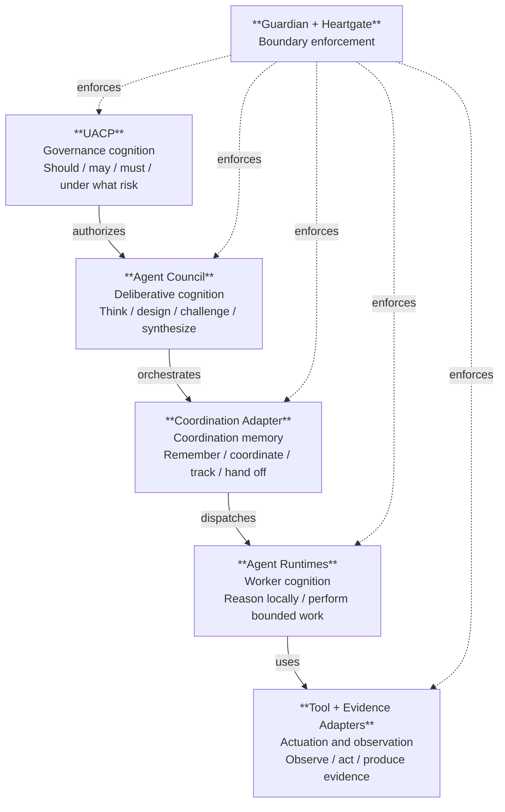

# UACP Orchestration Model

This document defines UACP's runtime-neutral multi-agent orchestration vocabulary. It is canonical for Agent Council, council modes, council tiers, runtime adapters, and the relationship between orchestration depth and UACP lifecycle granularity.

## Authority

This document derives from:

- `docs/index.md`
- `docs/constitution.md`
- `docs/lifecycle-reference.md`
- `docs/runtime-enforcement.md`

It is the downstream source for agent-skill implementations. Skills, runtime adapters, and deep-* compatibility wrappers must implement this document; they must not redefine it.

## Agent Council

Agent Council is a runtime-neutral multi-agent orchestration primitive.

It can be used for planning, proposal critique, execution support, verification, audit, research, brainstorming, design exploration, red-team review, or synthesis depending on:

- UACP phase,
- request granularity,
- risk and reversibility,
- affected domains,
- artifact type,
- authority and side effects,
- selected evidence clusters,
- runtime availability,
- required diversity of perspective.

Review is only one Agent Council mode. `agent-council` must not collapse into `deep-review`.


## Follow-Through Council Reruns

A follow-through council is a bounded Agent Council rerun/follow-up selected when a prior council or transition finding is marked handled. It is not a new lifecycle phase and it is not a substitute for Heartgate. Its scope is the handling artifact and affected transition evidence; it may reopen the original finding only when new evidence shows the handling changed the underlying risk.

Default recursion is capped at one follow-up rerun. If that rerun produces a new blocker or material concern, the next transition blocks or escalates through operator/Heartgate-selected routing instead of spawning unbounded councils.

Minimum routing should remain adaptive: bounded local council is sufficient for material concerns, while blockers, invariant failures, authority-boundary changes, lifecycle schema changes, or runtime enforcement changes should select role-diverse council. Cross-runtime or deep council is reserved for cases where runtime diversity or independent verification materially improves confidence.

## Council Modes

Council mode describes what the council is doing in a specific invocation.

Canonical modes:

- `plan`: decompose strategy, execution topology, scope, dependencies, and rollback.
- `propose`: challenge authority, scope, side effects, non-goals, and viability.
- `execute`: coordinate or support bounded workers while preserving traceability.
- `verify`: validate completed artifacts against selected evidence clusters.
- `audit`: search for compliance, security, privacy, governance, or process failures.
- `review`: critique an artifact or proposal for quality and risk.
- `research`: gather and synthesize grounded information.
- `brainstorm_design`: generate alternatives before narrowing.
- `resolve`: extract lessons, residual risk, memory/skill decisions, and closure notes.

A single UACP run may invoke different council modes in different phases. A council invocation must state its mode explicitly when the mode affects expected evidence or output shape.


## Phase-Local And Composite Granularity

UACP granularity is compositional.

Each lifecycle phase may have its own phase-local granularity score because the hard part of a run may concentrate in only one phase. The total run granularity is derived from the phase-local scores plus cross-phase coupling, not assigned as a single flat number at intake.

Phase-local granularity captures the governance complexity of work inside one phase:

- `TRIAGE`: ambiguity of intake, domain classification, risk detection, and routing confidence.
- `PROPOSE`: authority, side effects, scope negotiation, non-goals, and viability.
- `PLAN`: decomposition difficulty, dependency topology, rollback strategy, and evidence design.
- `EXECUTE`: implementation complexity, coordination depth, write surface, runtime/tool diversity, and integration seams.
- `VERIFY`: verification difficulty, finding severity, evidence quality, and confidence gap.
- `RESOLVE`: lesson extraction, residual risk, downstream skill/doc updates, and closure complexity.

Composite run granularity should account for:

- maximum phase-local granularity,
- cumulative phase-local granularity,
- cross-phase coupling between phases,
- unresolved warnings or findings carried forward,
- irreversible or externally visible side effects,
- runtime/domain diversity across the run.

Triage may produce an initial estimate, but later phases may revise their phase-local granularity as evidence appears. A run can therefore start low and become high-granularity if EXECUTE or VERIFY reveals complexity.

Each phase should re-evaluate granularity at least at phase entry and phase exit:

- **Entry estimate:** before doing phase work, estimate that phase's expected complexity using current artifacts, carried warnings, selected evidence clusters, and known side effects.
- **Exit actual:** after completing phase work, record the observed phase-local granularity and explain material deltas from the entry estimate.
- **Forward projection:** update projected granularity for downstream phases when new evidence changes their expected difficulty.

Council tier should be selected from the current phase-local granularity plus local risk and evidence needs. The total run granularity informs defaults and escalation, but it should not force every phase to use the same council tier.


## Human Involvement Selection

Human involvement is selected from both TRIAGE and phase-local reassessment.

TRIAGE can require human involvement immediately when authority is unclear, side effects are irreversible or externally visible, or the initial composite granularity/risk is too high for autonomous execution.

Later phases can also require human involvement when their phase-local entry estimate or exit actual crosses a threshold, when new side effects appear, when a council reports unresolved HIGH/CRITICAL findings, or when Guardian/Heartgate cannot classify a protected action safely.

Human involvement is therefore not only a run-level decision. It can be introduced at any phase boundary or protected-action checkpoint when new evidence changes the risk profile.

## Council Tiers

Council tier describes depth of multi-agent orchestration for one council invocation.

- `tier_0_single`: main orchestrator only; no council fan-out.
- `tier_1_bounded`: one to three bounded subagents or reviewers with narrow scope.
- `tier_2_role_diverse`: multiple role-diverse agents covering material dimensions such as architecture, safety, operations, domain fit, and verification.
- `tier_3_cross_runtime`: runtime-diverse or model-diverse council where independent runtime/tool perspectives materially improve confidence.
- `tier_4_deep_council`: council-of-councils or multi-stage adversarial protocol for critical, broad, or high-uncertainty work.

Tier selection is adaptive. Higher tiers are justified by risk, ambiguity, domain/runtime diversity, verification difficulty, or irreversible side effects, not by habit.

## Granularity Is Not Tier

UACP granularity is the end-to-end governance complexity of the whole request or proposal.

Council tier is the orchestration depth of one council invocation.

They are related but separate axes:

- a high-granularity run may default to `tier_2_role_diverse` or above,
- a small sub-check inside that run may use `tier_0_single` or `tier_1_bounded`,
- a low-granularity request may still use `tier_2_role_diverse` if runtime diversity or domain disagreement is the central risk.

`config/review-routing.yaml` maps granularity and risk to default council tiers, then applies override triggers.

## Roles And Diversity Dimensions

Council composition should be chosen from the evidence need, not from a fixed software checklist.

Common roles:

- `orchestrator`: frames scope, coordinates work, and synthesizes decisions.
- `domain_expert`: checks domain-specific correctness and context fit.
- `implementation_reviewer`: checks feasibility, maintainability, and execution constraints.
- `verification_reviewer`: checks acceptance evidence and test strategy.
- `devils_advocate`: actively searches for hidden failure modes and weak assumptions.
- `integrator_critic`: checks whether outputs cohere with UACP doctrine, existing architecture, and downstream extraction.
- `operator_proxy`: checks authority, reversibility, blast radius, and human-facing impact.

Diversity dimensions can include domain, runtime, model/toolchain, artifact type, stakeholder perspective, risk class, and temporal horizon.


## Execution Profiles And Agent Personas

Execution profiles are an implementation mechanism for binding a runtime worker to a stable execution persona and capability set.

A profile may define:

- model/provider/fallback chain,
- reasoning level or effort,
- toolsets and permissions,
- custom instruction stack or profile-local doctrine files,
- working directory / project context,
- memory and session isolation,
- gateway/external representation when applicable.

Profiles are not only public-facing identities. In UACP they may also be internal execution personas for Agent Council roles: planner, implementer, verifier, Devil's Advocate, Integrator Critic, safety/privacy reviewer, runtime/tool specialist, or evidence researcher.

Role and profile are related but not identical:

- `role` describes the cognitive responsibility inside a council invocation.
- `profile` describes the concrete runtime configuration used to perform that role.
- One profile may serve multiple roles if its instructions and tools fit.
- One role may be served by different profiles depending on phase-local granularity, risk, runtime/tool needs, and cost/quality tradeoffs.

UACP should select profiles deliberately during PLAN/EXECUTE/VERIFY rather than relying on whichever default worker profile happens to run. Profile selection is part of execution topology and should be recorded in council synthesis or Kanban task metadata when it affects outcome quality, permissions, model behavior, or verification confidence.

Profile-local instruction directories are useful for deep UACP execution because they can carry role-specific prompts, tool constraints, and project context. They must remain downstream implementation of UACP doctrine, not competing authority. If profile instructions conflict with UACP canonical docs/config, UACP wins.


### Profile Selection Versus Runtime Selection

UACP separates three choices:

```text
role = cognitive responsibility
profile = Hermes execution identity/configuration
runtime surface = where the work actually runs
```

A runtime execution profile may execute directly, receive durable coordination-adapter work, spawn native bounded subagents, or act as an adapter-controller for an external runtime such as Claude Code, Codex, OpenCode, Kimi, or Gemini. External runtimes must not be confused with profiles: the profile is the controller identity and instruction/config bundle; the runtime is the execution surface.

A bounded same-runtime branch is an in-process subagent surface. It can vary goal, context, toolsets, role, and model/provider settings, but it does not instantiate a separate profile home. When full profile isolation is required, use a coordination-adapter assignment to a named profile or a spawned profile-isolated runtime process.

In Hermes: the same-runtime branch is `delegate_task`, profile-isolated processes use `hermes --profile <name>`, and durable profile workers are assigned through Kanban.

PLAN should record both `profile_id` and `runtime_surface` when either materially affects permissions, model behavior, independence, evidence quality, or verification confidence.


### Same-Profile Branches Versus Profile Workers

A bounded same-runtime branch runs as an in-process bounded child with an ephemeral prompt. It can be role-framed, tool-limited, and in some cases model/provider-adjusted, but it does not load a separate profile home or profile-local doctrine stack.

Therefore UACP must not treat a same-runtime branch as equivalent to a full Agent Council profile when profile diversity matters.

Canonical distinction:

```text
same_runtime_branch: synchronous; low overhead; provisional cognition; no separate profile home.
  Hermes example: delegate_task
profile_worker: durable; profile-local config/doctrine/model/tool policy; isolated execution.
  Hermes example: Kanban-assigned profile or spawned `hermes --profile <name>` process
runtime_adapter: external execution surface controlled by a profile or orchestrator.
  Examples: Claude Code, Codex, OpenCode, Kimi, Gemini
```

Agent Council may run in two practical forms:

- `scratch_council`: same-runtime branches for fast brainstorming, provisional review, and low-risk analysis.
- `profile_council`: coordination-adapter/profile-backed workers for real role/profile diversity, durable debate rounds, and auditable review.

Kanban can support debate/review by representing each round as tasks and comments/artifacts. Kanban is still coordination memory, not the debating mind; the assigned profile workers perform the reasoning and the orchestrator/integrator synthesizes.

## Runtime And Runtime Adapters

A runtime is an execution environment capable of hosting an agent or worker, such as Hermes, Claude Code, Codex, OpenCode, Kimi, Gemini, or a future adapter.

A runtime adapter translates runtime-specific events and capabilities into UACP contracts:

- Guardian / Heartgate event schema,
- tool and side-effect provenance,
- authority and containment metadata,
- council task context,
- completion and verification evidence.

Hermes is the first host/runtime, not the conceptual boundary. Any runtime may act as orchestrator or worker if it obeys UACP contracts.

Runtime adapters are UACP-facing downstream implementation components. UACP defines the contract; adapters implement it without owning policy.


## Cognitive And Control-Plane Model

The relationship between UACP, Agent Council, Kanban, runtimes, and tools is not merely wiring. They occupy different cognitive/control planes.

UACP is the **governance cognition**: it decides whether work should happen, under what authority, with what phase-local/composite granularity, side-effect boundaries, evidence obligations, and human-involvement thresholds.

Agent Council is the **deliberative cognition**: it reasons about what should be done and how. It creates competing interpretations, decomposes strategy, assigns roles, challenges assumptions, critiques integration seams, and synthesizes decisions. Agent Council is where multi-perspective thought happens.

Hermes Kanban is the **coordination memory**: it records durable task units, dependencies, ownership, status, and handoff state. Kanban should not be treated as the thinker or governor. It preserves operational continuity for the plan that UACP authorized and Agent Council reasoned through.

Agent runtimes are the **worker cognition/execution loops**: they carry out bounded parts of the plan, possibly with their own local reasoning, but under the authority and context propagated from UACP and the council invocation.

Tool adapters and evidence services are the **actuation and observation surfaces**: they click, browse, scrape, search, compute, inspect, transcribe, or otherwise interact with the world. They do not decide governance or strategy by themselves.

The core mental model is therefore:

```text
UACP = should / may / must / under what risk
Agent Council = think together / design / challenge / synthesize
Kanban = remember / coordinate / track / hand off
Runtimes = reason locally / perform bounded work
Tools + evidence services = observe / act / produce evidence
Guardian + Heartgate = enforce the boundaries between these planes
```



This prevents category errors:

- Do not use Kanban to decide policy or strategy.
- Do not use Agent Council as a durable state database.
- Do not use tool adapters as autonomous authorities.
- Do not let worker runtimes silently change UACP phase state.
- Do not let UACP phase labels replace actual deliberation when council cognition is needed.

For implementation, the correct question is not "Kanban or Agent Council?" The correct question is:

> What cognition is required, what coordination must persist, and what execution/evidence surfaces are allowed?

## Execution, Tool, And Evidence Adapters

Not every execution surface is an agent runtime.

UACP distinguishes:

- `agent_runtime`: hosts an agent or worker loop, such as Hermes, Claude Code, Codex, OpenCode, Kimi, Gemini, or future runtimes.
- `tool_adapter`: lets an agent act through a tool, such as browser automation, Puppeteer/Playwright, computer use, terminal, OCR, or local scripts.
- `evidence_service`: retrieves or processes evidence, such as Firecrawl, Tavily, SearXNG, web search, scraping APIs, transcript services, or domain data providers.
- `control_substrate`: stores durable work state and dependencies, such as Hermes Kanban.

Firecrawl, Tavily, SearXNG, Puppeteer/Playwright, browser automation, and computer use should usually be modeled as tool/evidence adapters, not agent runtimes, unless they host autonomous agents themselves.

PLAN selects the execution topology: which agent runtimes, tool adapters, evidence services, and control substrates are allowed. Guardian enforces authority, side effects, provenance, path/interaction containment, and audit requirements for each selected surface.


### Locked Current Operating Mode

> **Hermes/current-deployment note:** The following operating mode applies to the current Hermes deployment. It is a snapshot of current practice, not a universal UACP architectural requirement. Future deployments or full-autonomy topologies may differ.

Until explicitly superseded, UACP operates in manual/semi-auto mode:

- `TRIAGE`, `PROPOSE`, `PLAN`, `VERIFY`, and `RESOLVE` are main-orchestrator-led by default.
- These phases may use `delegate_task` same-profile branches or external runtimes as helpers when justified.
- They should not use Kanban/coordination by default.
- `EXECUTE` is the primary phase for Kanban/coordination-adapter use when work is non-trivial.
- `delegate_task` is a same-profile scratch branch, not a profile worker.
- Named UACP profiles are role templates and optional/future execution identities unless async profile-specific work is explicitly justified.
- Hermes Kanban is a replaceable coordination adapter, not Agent Council doctrine.
- Full autonomous command-bot/phase-controller topology is reserved for a future design pass.

A Kanban task is a bounded work unit inside a phase, most often EXECUTE; it is not automatically equal to a UACP lifecycle phase.

### Current-Stage Profile Policy

> **Hermes/current-deployment note:** The following profile policy applies to the current Hermes deployment. Named profiles and delegation boundaries may differ in other runtimes or future autonomy topologies.

UACP currently operates in semi-auto/manual mode by default. Named UACP profiles are design targets and optional escalation identities, not mandatory workers for every phase.

Current delegation boundary:

```text
delegate_task = synchronous same-profile branch; no separate Hermes profile home.
coordination-adapter task = durable/asynchronous; can target named profiles when the adapter supports it.
```

Therefore `uacp-planner`, `uacp-verifier`, `uacp-devils-advocate`, and similar profiles should not be required for ordinary semi-auto/manual phase work. The main orchestrator may perform PLAN/VERIFY directly, optionally using same-profile scratch branches. Named profiles become active workers only when durable/asynchronous profile-specific coordination is justified.

The profile catalog reserves future topology slots for fully autonomous operation, where phase controllers or command-bot tasks may dispatch named profiles per phase. Until that mode is implemented, profile names should be treated as role templates and escalation targets rather than default phase executors.

### Phase-Specific Coordination Use

Not every UACP phase requires Hermes Kanban or any durable coordination adapter. Coordination substrate use is phase-local and need-based.

Default rule:

```text
Use direct reasoning or scratch branches when the phase can complete synchronously with clear evidence.
Use a coordination adapter when durable multi-worker state, profile-specific workers, dependencies, retries, regrouping, long timeouts, notifications, or full-autonomy command-bot execution are required.
```

`EXECUTE` is the phase most likely to require a coordination adapter because implementation work often needs durable ownership, dependency tracking, allowed-file boundaries, retries, verification obligations, and progress visibility.

`TRIAGE`, `PROPOSE`, `PLAN`, `VERIFY`, and `RESOLVE` may use a coordination adapter, but should not be forced through one by default. In full automation mode, each phase may be represented by command-bot/controller tasks, but that is an automation topology rather than a conceptual requirement.

A phase controller or deliberative `Insight` layer should choose the topology for each phase: direct, same-profile branch, profile council, cross-runtime council, coordination-adapter tasks, or human checkpoint. Kanban/coordination adapters only persist and dispatch the chosen units; they do not own planning intelligence.


### Coordination Adapter Contract Reference

Coordination adapters used for UACP EXECUTE task graphs should implement the substrate-neutral contract in `plans/uacp-agent-council-followthrough/13-coordination-adapter-contract.md` until promoted or superseded by canonical config/schema.

The adapter contract preserves the boundary that UACP/phase controllers own authority, topology, reruns, escalation, evidence sufficiency, and phase exit decisions, while the adapter owns only task persistence, assignment, dependency activation, comments/artifacts, notification, and provenance storage.

### Coordination Adapter Boundary

Hermes Kanban is the current durable coordination adapter for profile-backed work, but it is not the Agent Council substrate and not UACP doctrine.

Agent Council is an adaptive deliberation protocol. It owns roles, debate rounds, challenge rules, regrouping, reruns, escalation, synthesis, findings, and evidence obligations. A coordination adapter only persists and dispatches work units.

UACP must preserve this separation:

```text
Agent Council protocol = adaptive deliberation and synthesis
Coordination adapter = task/comment/artifact dispatch and persistence
Worker runtime = Hermes profile, delegate branch, external runtime, tool/evidence service, or human
UACP artifacts/state = canonical governance/evidence record
```

Kanban-hosted debates require an active coordinator/orchestrator loop. Passive task completion is insufficient for adaptive debate because reruns, regrouping, role changes, escalation, and synthesis-readiness decisions require deliberative control.

Any coordination substrate used by Agent Council should satisfy a replaceable adapter contract: create units, assign units, declare dependencies, attach context, attach/read artifacts or comments, mark state, retry/rerun units, and preserve provenance. Hermes Kanban is one implementation of this contract; future custom Kanban, issue trackers, or queue systems may implement the same contract.


### Full-Auto EXECUTE Controller Roadmap Slot

For the current UACP reramp, the first full-autonomy target is the `EXECUTE` phase only: a phase controller that creates bounded EXECUTE tasks, dispatches them through the coordination adapter, monitors completion/failure states, reads evidence, creates rerun/fix/escalation tasks, writes an EXECUTE evidence artifact, and declares pass/warn/block readiness for VERIFY.

This roadmap slot does not make the full lifecycle autonomous. Full lifecycle controllers remain deferred until the EXECUTE controller prototype is stable.

### EXECUTE Task Schema

Non-trivial `EXECUTE` work units should follow the schema defined in `plans/uacp-agent-council-followthrough/10-execute-task-schema.md` until promoted or superseded by a canonical config/schema file.

The schema requires each bounded work unit to declare objective, UACP/run reference, allowed and forbidden files/surfaces, runtime/profile choice, side effects, dependencies, verification/evidence obligations, rollback/escape path, and completion contract.

A Kanban task is a coordination-adapter representation of that bounded work unit, not the doctrine itself and not automatically a lifecycle phase.

## Implementation Through Agent Council

Implementation and execution are in scope for Agent Council.

For UACP work above direct/lightweight complexity, EXECUTE should normally use Agent Council as the orchestration layer over bounded implementation units. Hermes Kanban remains the durable task substrate; Agent Council supplies the role-aware worker topology, critique loops, fan-out/fan-in, and synthesis.

Execution hierarchy by cognitive responsibility:

```text
UACP lifecycle authority
  -> decides authority, phase, risk, human involvement, and evidence obligations
Agent Council deliberation
  -> decides strategy, decomposition, role topology, challenges, and synthesis
Hermes Kanban coordination memory
  -> records durable task units, dependencies, ownership, status, and handoffs
Selected runtimes / tool adapters / evidence services
  -> perform bounded work and produce completion evidence
VERIFY / RESOLVE
  -> consume evidence, findings, and lessons without erasing the earlier boundaries
```


Default implementation pattern:

1. PLAN selects council mode `execute` or a mixed `plan` + `execute` + `verify` topology.
2. The orchestrator decomposes implementation into bounded units with declared files, authority, side effects, verification, and rollback.
3. Council workers implement or inspect separate units according to assigned roles.
4. A Devil's Advocate or verification role checks high-risk assumptions and integration seams.
5. An Integrator Critic synthesizes outputs, resolves conflicts, and prepares VERIFY evidence.
6. VERIFY decides pass/warn/block from evidence and findings.

Do not reserve Agent Council only for review. Review-only use is one mode; implementation orchestration is also canonical when the task complexity justifies it.


## Agent Council Dispatch Protocol

A council invocation must declare:

- mode: `plan`, `propose`, `execute`, `verify`, `audit`, `review`, `research`, `brainstorm_design`, or `resolve`.
- tier: `tier_0_single` through `tier_4_deep_council`.
- phase-local granularity and local risk basis.
- roles and diversity dimensions selected.
- dispatch surfaces allowed: `delegate_task`, Hermes Kanban workers, external coding agents, browser/computer-use automation, web extraction/search services, or other approved adapters.
- tool/evidence adapter allowlist and side-effect boundaries.
- expected output artifact and finding format.
- retrieval obligations when the council is asked to validate governance, runtime, artifact-management, or security-sensitive claims.

Retrieval-led council rule:

- A council that reviews governance, runtime, artifact-management, Guardian/Heartgate, lifecycle, or security-sensitive claims must inspect ground-truth artifacts directly.
- The council prompt must name the concrete files, directories, commands, or evidence artifacts to inspect.
- The synthesis artifact must record `inspected_paths` and file/path evidence for material findings.
- A summary-only council may brainstorm or critique framing, but it must not be used to claim runtime/governance correctness.

Dispatch semantics:

- `tier_0_single`: main orchestrator only; may use approved local tools.
- `tier_1_bounded`: one to three bounded delegates or Kanban workers.
- `tier_2_role_diverse`: role-diverse Agent Council with explicit synthesis and, when needed, Devil's Advocate / Integrator Critic.
- `tier_3_cross_runtime`: multiple runtimes or materially independent toolchains; requires stronger provenance and completion evidence.
- `tier_4_deep_council`: multi-stage or council-of-councils protocol; requires explicit operator-visible rationale unless already approved in PLAN.

Mid-phase escalation semantics:

- If reassessment raises phase-local granularity but no protected action is in flight, apply the higher tier to pending work units.
- If a protected action is in flight and the new tier would require stronger review, pause before the next irreversible or externally visible side effect and create a re-plan or checkpoint artifact.
- If the escalation is caused by a HIGH/CRITICAL finding, block phase exit until resolved, accepted by the correct authority, or moved into a documented re-plan.

## Relationship To UACP Phases

## Phase-local and Heartgate Council Split

Agent Council can appear in two positions with different jobs:

1. **Phase-local council** — attached to a phase's own work. It reviews or executes the phase output according to the selected mode: propose critique, plan review, execute implementation review, verify audit, or resolve lessons. Its object is the work product inside the phase.
2. **Heartgate council** — attached to the transition boundary. It evaluates whether the phase as a whole fulfilled its declared lifecycle responsibility and whether moving forward would be truthful. Its object is the phase transition, not the raw work product.

Heartgate council checks include doctrine coherence, docs/config/state consistency, runtime-state alignment, warning/deferred-item honesty, boundary-role integrity, and next-phase readiness. It should detect cases where implementation, artifacts, or Kanban state quietly redefine UACP doctrine.

A phase-local council may say "the implementation is good" while Heartgate still blocks because artifacts disagree, warnings are unowned, phase state is stale, or the next phase would inherit incoherent assumptions. Conversely, Heartgate may pass with warnings when phase-local findings are accepted and correctly carried forward.

Each phase may invoke Agent Council when useful:

- `TRIAGE`: classify scope, risk, domains, routing, and possible council tier.
- `PROPOSE`: challenge authority, side effects, non-goals, and governance fit.
- `PLAN`: design execution topology, task graph, evidence clusters, and rollback.
- `EXECUTE`: coordinate bounded implementation workers while preserving UACP context propagation. For non-trivial implementation, Agent Council is the preferred execution topology: council roles decompose, implement, cross-check, and synthesize bounded work units instead of leaving implementation as a single-agent linear pass.
- `VERIFY`: run finding-driven review, validation, audit, and synthesis.
- `RESOLVE`: extract lessons, update downstream skills, and decide residual risk.

Council outputs are evidence artifacts, not authority by themselves. Authority still flows through `docs/index.md`, canonical prose docs, config, runtime state, skills/runtime behavior, and execution artifacts in that order.

## Finding-Driven Pattern

For review, audit, verification, and research modes, councils should produce structured findings rather than only prose opinions.

A finding should include:

- id,
- severity,
- summary,
- evidence,
- affected artifact,
- recommended action,
- owner or disposition,
- state: `open`, `resolved`, `accepted_risk`, `not_applicable`, or `deferred`.

VERIFY and RESOLVE decide whether findings block, warn, or pass according to selected evidence clusters and non-waivable invariants.

### Blocker, concern, and rerun protocol

Council findings must be resolved before they are allowed to become transition evidence:

- `blocker`: phase transition is blocked until the issue is patched, explicitly rescoped, or rejected with human authority.
- `concern`: must be patched, accepted as residual risk, or deferred with owner, acceptance, and condition.
- `rerun_required`: true when the finding touches a boundary the next phase depends on, such as Guardian writer containment, Heartgate transition truthfulness, council artifact schema, runtime tool exposure, or protected state mutation.
- Rerun synthesis must cite the original finding IDs, the patch or accepted-risk artifact, and updated inspected paths/evidence.

A council rerun is not ceremony. It is required when the previous council found a blocker or boundary-touching concern and later work claims that finding is resolved.

## Deep-* Compatibility

`deep-review`, `deep-audit`, `deep-verify`, `deep-research`, and `deep-council` are not canonical UACP doctrine.

They may remain as downstream compatibility aliases or convenience wrappers only if they dispatch into Agent Council modes and tiers defined here. New UACP doctrine must not depend on deep-* wrapper semantics.

## Downstream Extraction Rule

The `agent-skills` branch is source material, not canonical authority. After this doctrine stabilizes, downstream skills should be re-extracted from UACP with this document as the orchestration source of truth.
