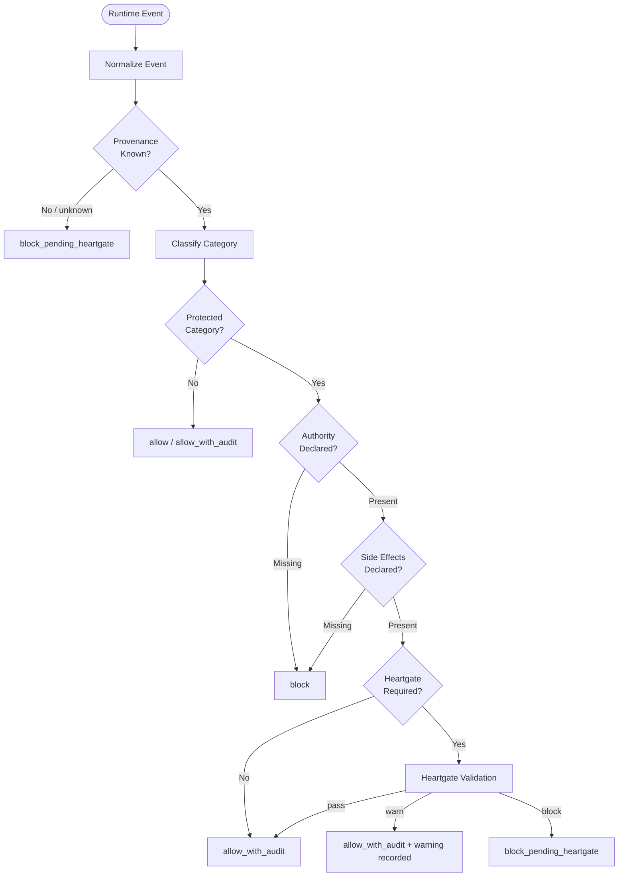

# UACP Runtime Enforcement

This document defines how UACP becomes mechanically enforced at runtime. It is the canonical design for Guardian and Heartgate. It does not replace the constitution, lifecycle reference, or config files; it explains how runtime adapters must implement them.

## Purpose

UACP cannot rely on prompt discipline, skill instructions, or after-the-fact review alone. Runtime enforcement must block unsafe or invalid actions before they execute, especially when actions mutate UACP state, write outside declared containment, trigger external side effects, or advance lifecycle phases.

The production design has two enforcement planes:

- Guardian: runtime tool and side-effect enforcement.
- Heartgate: lifecycle transition enforcement.

Both derive authority from the UACP document chain. Neither may invent policy in code.

## Authority Boundary

Runtime enforcement follows the document authority order in `docs/INDEX.md`:

1. `docs/INDEX.md`
2. canonical prose docs
3. YAML config
4. runtime state pointers
5. skills and runtime implementation
6. execution artifacts

If docs, config, and state conflict, Guardian and Heartgate fail closed for protected actions until the conflict is resolved or an explicit recovery authority is recorded.

## Runtime Trust Boundary

UACP governs actions inside a declared runtime boundary. It does not claim to prevent arbitrary human or host-side mutation outside that boundary, such as editing files in VS Code, changing repository contents manually, or running an external runtime without UACP integration enabled.

Out-of-band mutation is treated as untrusted input until revalidated. When a file, config, plugin binding, or artifact may have changed outside a governed runtime path, the correct response is to re-run the relevant verification and update evidence before relying on it. UACP records whether the current runtime posture is verified; it does not pretend that mutable user files are impossible to change.

Containment is a host/runtime property, not a self-declared UACP permission. UACP may declare that a phase or action requires contained execution; Guardian may verify that the runtime has provided that containment before allowing protected shell/code execution. If the runtime cannot provide or prove the required posture, UACP-bound execution remains fail-closed.


## Heartgate Follow-Through Gate Enforcement

Heartgate must fail closed when a transition claims that a blocker, concern, invariant failure, negative finding, or material warning has been handled but the transition artifact does not preserve the handling chain required by lifecycle policy.

For material findings marked `remediated`, `expanded`, or `justified`, Heartgate expects a handling artifact and follow-up Agent Council synthesis unless an explicit accepted exception is present. For `deferred`, `accepted_warning`, or `rejected_with_reason`, Heartgate expects owner, residual risk, and next-phase obligation fields and may require follow-up council based on severity or routing.

Agent Council remains evidence, not approval. Heartgate independently checks the transition artifact, invariant status, warnings/deferred items, accepted exceptions, authority, side effects, and next-phase readiness. Missing required follow-through evidence blocks the transition rather than being normalized to pass.

## Runtime Components

| Component | Responsibility | Authority |
|---|---|---|
| Guardian core | Runtime-neutral policy engine for tool calls, paths, state mutation, side effects, and audit decisions. | Implements docs/config/state. |
| Heartgate core | Runtime-neutral phase transition validator. | Implements lifecycle and transition config. |
| Policy packs | Runtime-neutral policy bundles for UACP, Trustless ACP compatibility, or future project/domain-specific governance. | Derived from canonical docs/config; selected by declared governance context. |
| Hermes adapter | Hermes plugin and runtime integration using `pre_tool_call`, `post_tool_call`, and any required control-plane hooks. | Thin adapter only. |
| State mutation tool | The only approved runtime path for UACP runtime-state writes after bootstrap closure. | Implements `uacp-state` policy. |
| Kanban control-plane guard | Protects UACP-bound Kanban task creation, worker spawning, metadata propagation, and completion evidence. | Keeps Kanban as task substrate only. |
| Audit writer | Writes runtime enforcement events to logs and durable UACP artifacts when needed. | Observational, not policy authority. |

## Policy Packs And Runtime Adapters

Guardian is a runtime-neutral enforcement kernel plus policy packs and runtime adapters.

Policy packs encode which governance doctrine applies to a normalized runtime event. The primary policy pack is UACP. Trustless ACP is source material for compatibility where useful, but UACP must not inherit fixed Trustless gate numbers, software-only assumptions, or project-specific path schemas as universal doctrine.

Runtime adapters are UACP-facing downstream implementation components. They translate runtime-specific payloads into normalized Guardian and Heartgate events, pass authority and side-effect metadata, and return decisions/audit evidence to the host runtime. Adapters may include Hermes, Claude Code, OpenCode, Codex, Kimi, Gemini, or future runtimes.

Hermes is the first host/runtime, not the conceptual boundary. Adapter code must stay thin: it may translate, enforce, and audit, but it must not own policy that belongs in UACP docs/config.


## Cognitive Boundary Enforcement

Guardian and Heartgate enforce boundaries between UACP's cognitive/control planes:

- UACP owns governance authority, phase transitions, side-effect permission, human-involvement thresholds, and evidence obligations.
- Agent Council owns deliberative orchestration when selected: role topology, challenge, synthesis, and execution strategy.
- Hermes Kanban owns durable coordination state: task graph, dependencies, status, ownership, and handoffs.
- Agent runtimes, tool adapters, and evidence services perform bounded work or observation under declared authority.

Runtime enforcement must not let one plane silently impersonate another. Kanban mutations must not change UACP phase state. Tool/evidence adapters must not create authority. Worker runtimes must not broaden side effects beyond the plan. Council outputs are evidence and recommendations until accepted by the relevant UACP phase transition.

## Guardian Core

Guardian evaluates normalized runtime events, not raw runtime-specific payloads.

Required event fields for every Guardian event:

- `runtime`
- `adapter`
- `event_type`
- `tool_provider`
- `tool_name`
- `tool_args`
- `task_id`
- `session_id`
- `tool_call_id`

Additional required fields for UACP-bound events and all protected actions:

- `workspace`
- `uacp_run_id`
- `uacp_phase`
- `policy_version`
- `declared_authority`
- `declared_side_effects`

Decision values:

- `allow`
- `allow_with_audit`
- `require_approval`
- `block`
- `block_pending_heartgate`



Conservative failure rule: if a protected action lacks enough context to classify safely, Guardian returns `block` or `block_pending_heartgate`.

Tool classification must use provenance as well as name. Runtime core tools, plugin-registered tools, MCP tools, and inline agent-loop tools can share ordinary-looking tool names. If provenance is missing for a non-core tool, Guardian treats the action as `runtime.extension` until classified.

## Mutation Categories

Guardian classifies actions by side-effect category, not only by tool name.

| Category | Examples | Default handling |
|---|---|---|
| `read.local` | local file reads and searches | allow |
| `external.network_read` | web search and extraction | allow with privacy checks |
| `file.write` | `write_file`, `patch`, generated file writes | require declared path scope |
| `state.uacp` | writes under `state/` | only via state mutation tool |
| `state.kanban` | Kanban complete, block, create, link, comment | allowed only as task traceability |
| `memory.persistent` | memory writes, skill mutation | require storage-boundary decision |
| `exec.shell` | terminal commands | high risk; phase and containment gated |
| `exec.code_with_tool_proxy` | code execution that can call tools | deny unless tool subset is approved |
| `external.browser_interact` | browser click, type, submit, JS eval | require declared external side effect |
| `external.human_message` | sending messages or publishing | require explicit recipient/content authority |
| `external.physical_device` | Home Assistant or desktop/device control | strict approval and rollback/stop path |
| `runtime.subagent` | `delegate_task`, Kanban worker spawn, background agent review | require context propagation and bounded authority |
| `runtime.extension` | plugin install/update, MCP dynamic tools | default deny until classified |
| `automation.future` | cron jobs, background services | require owner, duration, stop path, and rollback |

Dynamic tools from plugins or MCP servers default to `runtime.extension` or `external.unknown_mutator` unless their manifest or policy classifies them as read-only.

Shell enforcement must not rely on command-string inspection alone. For UACP-bound execution, protected write paths such as `state/` must be enforced below the shell command by a filesystem guard, sandbox, read-only mount, or equivalent runtime containment. If that containment is unavailable, `exec.shell` actions that could reach protected UACP paths are blocked in enforce mode. Post-run diff detection is useful audit evidence, but it is not sufficient enforcement.

## Heartgate Core

Heartgate validates lifecycle movement:

```text
TRIAGE -> PROPOSE -> PLAN -> EXECUTE -> VERIFY -> RESOLVE
```

Each transition must satisfy:

- transition is allowed by the canonical phase graph (`engines/domain/phase_graph.py` `LIFECYCLE_GRAPH`; `config/phase-transitions.yaml` retains adaptive-gate doctrine only);
- current pointer, run manifest, transition artifact, and phase fields agree;
- required transition inputs exist and parse;
- non-waivable invariants are pass/block only and all pass;
- required evidence clusters are pass or accepted warn;
- blockers are resolved;
- warnings have owners and residual risk;
- deferred items are explicitly accepted by the next phase;
- side effects are declared;
- write containment is recorded;
- state changes are traceable.

Heartgate is not a fixed gate checklist. It validates the selected adaptive evidence set plus invariant checks.

### Heartgate Full Check List (pc_p1_gov_4)

The current runtime-neutral kernel runs the following checks in
`Heartgate.validate_transition()`, in order. Any blocker fails the transition;
warnings are surfaced but allow passage if owned.

| Order | Check | Source | Blocks on |
|---|---|---|---|
| 1 | required_fields | `engines/domain/phase_transitions.py` (`phase_transition_required_fields()`; codified Slice 5, used when the `artifact_schema.required_fields` key is absent) | missing required field |
| 2 | transition_allowed | `engines/domain/phase_graph.py` (`LIFECYCLE_GRAPH`; `stages` codified Slice 4b, `exits_to` derived from the canonical graph) | unauthorized from→to |
| 3 | invariant_summary | transition artifact | any invariant status ≠ pass |
| 4 | cluster_summary | transition artifact | cluster block / unaccepted warn / undeferred-deferred / invalid state |
| 5 | blockers | transition artifact | any unresolved blocker |
| 6 | warnings | transition artifact | warnings without owner+residual_risk |
| 7 | deferred_items | transition artifact | items without owner/condition/accepted_by |
| 8 | heartgate_coherence | transition artifact `heartgate_coherence` block | missing artifact_path / unmet lenses / status=block |
| 9 | heartgate_coherence_required_when | `engines/domain/gate_rules.py` (`heartgate_coherence_required_when` key in `gate_rules_default()`; `config/phase-transitions.yaml` retains doctrine only) | required-but-absent coherence evidence |
| 10 | phase_exit_invariants (Phase 1.2) | `engines/domain/phase_transitions.py` (`stages_default()` `<from>.phase_exit_invariants`; `stages` codified Slice 4b, injected by `load_phase_transitions` when absent from YAML) | required artifact glob unmet / gate-ledger entry missing |
| 11 | ppv_record (Phase 1.4 / Global review SKEP-G-002; legacy post-phase verification ledger rule, formerly "piv_record"/`gate: PIV`) | `engines/domain/gate_rules.py` (`ppv_rule_default()`; `config/phase-transitions.yaml` retains doctrine only) + `state/gate-ledger/{run_id}.jsonl` | no PPV pass with per-check evidence; 2 PPV failures; malformed `ppv_rule`; corrupt ledger line. Per-check pass evidence (each `ppv_id` ∈ `{ppv_1..ppv_5}` carrying explicit `result: pass` either as a `checks[]` mapping entry or via sibling `check_results: {ppv_id: pass}`) is required — generalizes the Phase 3 R1 PLAN_VALIDATION contract. (Distinct from Phase Intent Verification / PIV.) |
| 12 | intent_doc (Phase 2.3) | `engines/domain/artifact_schema.py` (`artifact_schemas_dict()` key `intent`; `config/artifact-schemas.yaml` deleted Slice 5) + `proposals/{run_id}-intent.md` | TRIAGE→PROPOSE: missing file or missing required section |
| 13 | scope_artifact (Phase 2.1) | `engines/domain/artifact_schema.py` (`artifact_schemas_dict()` key `scope`) + `plans/{run_id}-scope.yaml` | PLAN→EXECUTE: missing file / missing required fields / write_paths not reachable by Layer B allowed_tools |
| 14 | evidence_dispositions (Phase 2.2) | `engines/domain/artifact_schema.py` (`artifact_schemas_dict()` key `evidence_disposition`) + `verification/{run_id}-{cluster}-(verified-facts\|assumptions).md` | VERIFY→RESOLVE: missing pair files / unowned `pending` assumption |
| 15 | lessons_artifact (Phase 2.4) | `engines/domain/artifact_schema.py` (`artifact_schemas_dict()` key `lessons`) + `.outputs/{run_id}-lessons.yaml` | VERIFY→RESOLVE: missing file / missing required fields / malformed shape |
| 16 | plan_validation_gate (Phase 3.1) | `engines/domain/gate_rules.py` (`plan_validation_gate_default()`; `config/phase-transitions.yaml` retains doctrine only) + run gate ledger | PLAN→EXECUTE: missing `PLAN_VALIDATION` pass record / wrong `phase` / missing pv_ids in `checks` list / corrupt ledger line |
| 17 | run_registry_overlap (Phase 3.2) | `engines/domain/gate_rules.py` (`run_registry_rule_default()`; `config/phase-transitions.yaml` retains doctrine only) + `state/run-registry.yaml` + `plans/{run_id}-scope.yaml` | PLAN→EXECUTE: any other active run's `write_paths` overlap this run's (PurePosixPath-segment match) / malformed registry entries |
| 18 | declared_decision | transition artifact `decision` field | declared `block` |

Heartgate also owns the **transition coherence check**. A phase-local council reviews the phase's own work; Heartgate decides whether the lifecycle boundary is truthful. For medium/high-risk transitions, Heartgate may invoke or require a Heartgate Council whose mandate is cross-artifact coherence and consistency, not duplicate implementation review.

Heartgate Council checks:

- phase objective satisfied against the proposal/plan;
- required artifacts and selected evidence clusters exist and parse;
- docs, config, state, runtime behavior, tests, and verification artifacts tell the same story;
- phase-local council findings are resolved, accepted with owners, or blocking;
- warnings/deferred items are honestly carried into the next phase;
- Kanban, Guardian, Heartgate, Agent Council, and runtime adapters have not drifted into each other's authority roles;
- the next phase has a coherent state and explicit obligations.

## Hermes Adapter Requirements

Hermes runtime enforcement starts with a plugin adapter, but the plugin alone is not the whole solution.

The adapter must:

- register `pre_tool_call` and block before execution;
- register `post_tool_call` for audit;
- pass `session_id` and `tool_call_id` into Guardian decisions;
- pass tool provenance into Guardian decisions;
- handle plugin-registered tools;
- avoid hidden policy inside adapter code;
- load policy from `config/uacp.toml [guardian]` (collapsed from legacy guardian-policy.yaml in Slice 3);
- resolve paths through symbolic roots;
- fail closed for protected actions when policy cannot be loaded.

Known Hermes gaps that must be closed during implementation:

- current hook errors are fail-open by default;
- some `run_agent` prechecks do not pass full session/tool identifiers;
- inline agent-loop tools do not all emit post-tool audit events;
- `PluginContext.dispatch_tool()` can bypass model tool hooks;
- slash commands and dashboard/control-plane actions are outside normal tool-call hooks.
- generic delegation currently starts child agents from prompt/context only, so UACP context must be explicitly injected and audited.

Guardian enforce mode cannot be activated until plugin/internal dispatch and hook-error fail-closed behavior are covered by the guarded dispatch path. Observe mode may record gaps, but it must not be represented as runtime enforcement.

## Kanban Enforcement

Kanban is a task substrate, not UACP phase state. Guardian must still cover UACP-bound Kanban work because workers are separate Hermes processes.

Requirements:

- UACP-bound Kanban tasks carry run id, phase, policy version, and workspace metadata.
- UACP-bound Kanban metadata is stored in a dedicated task-level context record, not only in worker prose or completion metadata.
- Dispatcher refuses UACP-bound tasks missing required Guardian metadata.
- Worker processes receive UACP context through environment or task metadata.
- Worker completion includes Guardian verdict evidence or an explicit missing-verdict warning.
- VERIFY detects UACP Kanban tasks without Guardian audit evidence.
- `/kanban`, CLI, dashboard, and API mutations that affect UACP-bound tasks are guarded by control-plane checks, not only model `pre_tool_call`.

A Kanban task is UACP-bound when any of these conditions are true:

- it has an explicit UACP task context record;
- it is on the configured UACP board and is the active root task recorded in UACP state;
- it is on the configured UACP board and is a descendant of an active UACP root task;
- it is created by a UACP lifecycle/state tool;
- it is explicitly marked UACP-bound by a guarded control-plane request.

If the detector cannot decide safely for a mutation on the configured UACP board, the control-plane guard treats the task as UACP-bound until proven otherwise.

Required worker environment names:

- `UACP_ROOT`
- `UACP_RUN_ID`
- `UACP_PHASE`
- `UACP_GUARDIAN_POLICY_VERSION`
- `UACP_WORKSPACE_POLICY`
- `UACP_GUARDIAN_MODE`

Required Guardian evidence shape in Kanban completion metadata:

```yaml
guardian:
  policy_version: ""
  mode: "enforce"
  verdicts:
    - decision: "allow | allow_with_audit | require_approval | block | block_pending_heartgate"
      category: ""
      audit_artifact: ""
  missing_verdicts: []
```

### Governed-writer call conventions (tool surface)

A tool-surface agent calling the governed writers (`uacp_entity_write`, `uacp_artifact_write`,
`uacp_state_write`, `uacp_gate_ledger_append`, `uacp_run_registry_update`, …) must supply the
full context envelope — a missing field is treated as absent run context and BLOCKS admission
(`Guardian._missing_context`):

- `workspace`, `uacp_run_id` (non-empty), `uacp_phase` (non-empty), `declared_side_effects`.
- `policy_version` — MUST equal `[guardian].schema_version` in `config/uacp.toml` (currently
  **`"0.1"`**); not the top-level `schema_version` (`0.2.0`).
- `authority_artifact` is the canonical authority param; **`declared_authority` is accepted as
  an alias** for the same value. Supply one — authority is REQUIRED.

These values are enforced by the kernel; previously they were discoverable only from source
(dogfood run #2, #126). Run-less artifacts (e.g. a handoff with no active run) cannot pass
admission because the envelope requires non-empty `uacp_run_id`/`uacp_phase` (#119 family).

## State Mutation

After bootstrap closure, runtime state mutation must go through a guarded state mutation path. Direct writes to `state/` are blocked unless explicitly authorized for recovery.

The state mutation path must validate:

- target path is UACP-root-relative;
- target path is within allowed state scope;
- YAML parses;
- required state fields exist;
- authority artifact exists;
- mutation reason is recorded;
- provenance is appended or referenced;
- canonical docs/config are not mutated through the state path.

### Writer-To-Path Map

The authoritative mapping from each governed writer to the paths it may write (the mapping AGENTS.md Invariant #3 refers to). It is generated from the kernel — the tool registry (`skills/uacp-core/scripts/tool_specs.py`), the state-handler carve-outs (`skills/uacp-state/scripts/state.py`), the handler path validation (`skills/uacp-core/scripts/governed_handlers.py`), and the layout registry (`skills/uacp-core/scripts/engines/domain/layout.py`) — by `python3 scripts/gen_doc_tables.py --write`; the drift lint fails CI when this block and the kernel disagree. Paths shown under `.uacp/` follow the default `config/uacp.toml [paths]` names.

<!-- BEGIN GENERATED: writer-path-map — derived from tool_specs.py + state.py carve-outs + governed_handlers.py path validation + engines/domain/layout.py by scripts/gen_doc_tables.py; do not edit by hand -->
| Governed writer | Writes | Exclusivity / notes |
|---|---|---|
| `uacp_state_write` | `.uacp/state/**` | Generic state writer. Refuses the exclusive carve-outs below (`state/gate-ledger/`, `state/run-registry.yaml`, `state/escalations/`, `state/runs/`); writes to `state/current.yaml` are caller-bound (`active_run_id` must match the caller's `uacp_run_id`). |
| `uacp_gate_ledger_append` | `.uacp/state/gate-ledger/{run_id}.jsonl` | Exclusive append-only ledger writer. |
| `uacp_run_registry_update` | `.uacp/state/run-registry.yaml` | Exclusive registry mutator (`op=register`/`deregister`). |
| `uacp_escalation_event` | `.uacp/state/escalations/{run_id}.jsonl` | Exclusive append-only escalation writer. |
| `uacp_run_init`, `uacp_run_transition`, `uacp_run_register_artifact`, `uacp_run_finalize` | `.uacp/state/runs/{run_id}.yaml` + `.uacp/state/current.yaml` (seeded by `uacp_run_init` when absent) + `.uacp/state/gate-ledger/{run_id}.jsonl` (canonical `FROM->TO`/`TRIAGE_COMPLETE` records emitted by `uacp_run_transition`) | Exclusive owners of the run manifest (the uacp-state run-lifecycle operations). The pointer seed and canonical ledger emits are SECONDARY writes: the manifest is the primary surface. |
| `uacp_entity_write` | RELATION-plane manifest kinds → `.uacp/brainstorm/`, `.uacp/executions/`, `.uacp/plans/`, `.uacp/proposals/`, `.uacp/resolutions/`, `.uacp/verification/` per the layout registry (`skills/uacp-core/scripts/engines/domain/layout.py`) | The ONLY writer for manifest documents: validates by `kind`, records watermarks under `.uacp/state/hashes/`, and registers the entity into the run manifest (`.uacp/state/runs/{run_id}.yaml`). |
| `uacp_artifact_write` | `.uacp/brainstorm/`, `.uacp/executions/`, `.uacp/knowledge/`, `.uacp/lessons/`, `.uacp/plans/`, `.uacp/proposals/`, `.uacp/resolutions/`, `.uacp/verification/` | Non-manifest artifacts only; rejects `state/`, `docs/`, `config/` and any RELATION-plane manifest kind (use `uacp_entity_write`). Records watermarks under `.uacp/state/hashes/`. |
| `uacp_doc_write` | `docs/**` (`.md`; repo-root-relative, not under `.uacp/`) | Canonical docs boundary. |
| `uacp_config_write` | `config/**` (`.yaml`/`.yml`; repo-root-relative, not under `.uacp/`) | Canonical config boundary. |
| `uacp_contained_shell` | the declared execution workspace only | Contained shell surface (bwrap read-only root); mints state, not a namespace writer. |

Read-only governed tools (no write path): `uacp_sandbox_check`, `uacp_heartgate_check`, `uacp_oracle_query`.
<!-- END GENERATED: writer-path-map -->

## Audit

Runtime audit has two layers:

- ephemeral runtime logs under `HERMES_ROOT/logs/uacp/`;
- durable UACP artifacts under `verification/`, `executions/`, `state/runs/`, `.outputs/`, or `knowledge/` when a checkpoint or phase decision needs evidence.

Audit records are evidence, not authority. They must not create unmanaged canonical documents.

Minimum audit record fields:

- `policy_version`
- `uacp_run_id`
- `uacp_phase`
- `runtime`
- `adapter`
- `tool_provider`
- `tool_name`
- `category`
- `decision`
- `reason`
- `workspace`
- `authority_artifact`
- `side_effects`
- `audit_artifact`
- `runtime_commit`
- `uacp_commit`

## Breakglass

Breakglass exists for recovery only.

Breakglass requirements:

- explicit operator authority;
- reason;
- affected paths or side effects;
- expiry or one-shot scope;
- audit record;
- follow-up verification.

Breakglass must not silently disable Guardian for an entire runtime.

Disabling the Guardian plugin is a breakglass action. It requires explicit operator authority, affected scope, expiry or one-shot recovery scope, an audit artifact, and follow-up verification. A permanent or unscoped disable is blocked by policy.

## Adapter Compatibility

Future Codex, OpenCode, and Claude adapters must call the same Guardian and Heartgate cores through normalized events. Runtime-specific adapters may translate payloads but must not own policy.

Trustless ACP is source material for this split of core and adapter. UACP must not port fixed Trustless gate numbers, software-only proposal assumptions, or Trustless-specific path/state schemas.

## Implementation Order

1. Guardian policy config.
2. Normalized event and decision schemas.
3. Guardian core.
4. Heartgate core.
5. Hermes `pre_tool_call` adapter.
6. Audit logging.
7. State mutation tool.
8. Hook coverage fixes.
9. Plugin dispatch guard.
10. Kanban control-plane guard.
11. VERIFY detector for missing Guardian evidence.
12. Live activation and proof tests.

Runtime enforcement is not complete until both tool-call enforcement and Kanban/control-plane enforcement are active.
