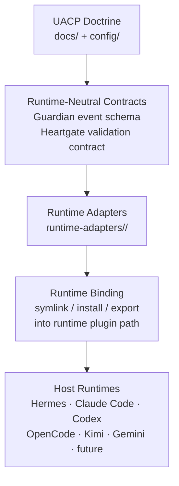
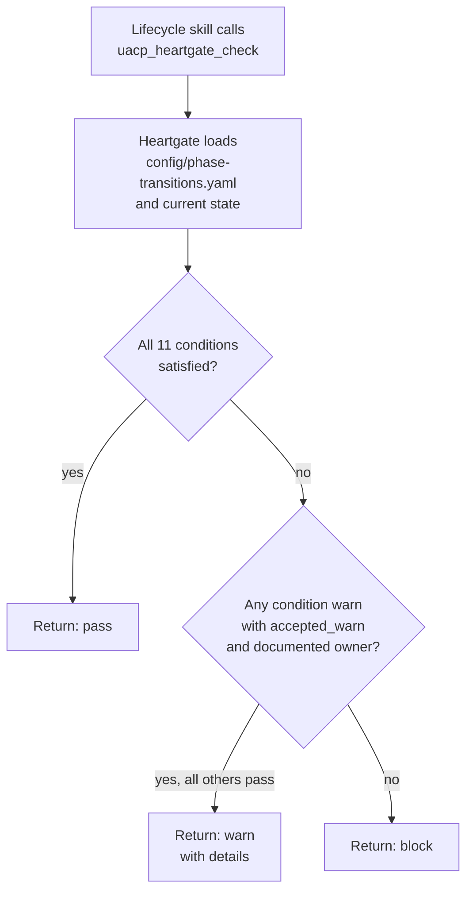

# UACP Runtime Integration Guide

This guide specifies everything a runtime implementer must build to integrate a new agent runtime with the Universal Agent Control Plane (UACP). A runtime adapter is a thin, runtime-specific translation layer that receives events from the host runtime, normalizes them into UACP's runtime-neutral schemas, routes them through Guardian and Heartgate, and returns decisions in the form the host runtime expects. This document covers the adapter authority model, required schemas, hook and tool registrations, policy loading, binding procedure, audit requirements, and common implementation pitfalls. It is written for implementers who are not familiar with any existing adapter.

---

## Table of Contents

1. [What a Runtime Adapter Is (and Is Not)](#1-what-a-runtime-adapter-is-and-is-not)
2. [Authority Model](#2-authority-model)
3. [Guardian Event Schema](#3-guardian-event-schema)
4. [Tool Provenance Classification](#4-tool-provenance-classification)
5. [Heartgate Validation Contract](#5-heartgate-validation-contract)
6. [Required Runtime Hooks](#6-required-runtime-hooks)
7. [Required Tool Registrations](#7-required-tool-registrations)
8. [Policy Loading Requirements](#8-policy-loading-requirements)
9. [Binding Sequence](#9-binding-sequence)
10. [Environment Variables](#10-environment-variables)
11. [Audit Requirements](#11-audit-requirements)
12. [Verification Checklist](#12-verification-checklist)
13. [Rollback Requirements](#13-rollback-requirements)
14. [Known Implementation Pitfalls](#14-known-implementation-pitfalls)
15. [See Also](#15-see-also)

---

## 1. What a Runtime Adapter Is (and Is Not)

A runtime adapter is a thin, runtime-specific translation layer that:

- Receives runtime-native events (tool calls, hook callbacks, plugin registrations)
- Normalizes them into the runtime-neutral Guardian event schema
- Returns Guardian decisions to the runtime in whatever form the runtime expects
- Does not own policy — policy lives in `config/uacp.toml [guardian]` and in the canonical docs

Adapters may translate, enforce, and audit. They must not encode policy inline.

### What adapters do not own

- **Policy** — lives in `config/uacp.toml [guardian]` and the canonical document chain; the adapter loads and applies it, never defines it
- **Phase state** — lives in `state/`; mutated only through `uacp_state_write`
- **Lifecycle authority** — Guardian and Heartgate derive rules from the document chain (`docs/` and `config/`), not from adapter logic

An adapter that encodes a policy decision inline — for example, hardcoding a specific tool name as "always allowed" — has violated the authority model. All such decisions must flow from loaded policy.

---

## 2. Authority Model

Authority in UACP flows strictly downward through a layered chain. No layer may override or reinterpret the layer above it.

**UACP Doctrine** is the authoritative layer. It includes the lifecycle specification, first principles, constitution, Guardian and Heartgate design, and phase-transition configuration. All lower layers derive their validity from this layer.

**Runtime-neutral contracts** are the stable interfaces — the Guardian event schema and the Heartgate validation contract — that allow any conforming adapter to plug into any conforming runtime without modification to the doctrine.

**Runtime adapters** implement those contracts for a specific host runtime. They are located under `runtime-adapters/<runtime>/`. They may handle runtime-specific event shapes, authentication conventions, tool schema registration formats, and hook lifecycle differences — but they apply doctrine without modifying it.

**Runtime binding** is the mechanical step of installing the adapter into the host runtime's plugin path, package registry, or hook registry so the runtime loads it.

**Host runtimes** are the execution environments that run agents. They invoke the adapter on every relevant event and act on the decisions returned.

---

## 3. Guardian Event Schema

Every Guardian evaluation requires a normalized event object. The runtime adapter is responsible for constructing this object from runtime-native data before calling Guardian.

### 3.1 Required fields for all events

| Field | Type | Description |
|---|---|---|
| `runtime` | string | Runtime identifier (e.g., `hermes`, `claude-code`, `codex`) |
| `adapter` | string | Adapter name and version (e.g., `uacp_guardian_hermes@1.0.0`) |
| `event_type` | string | `pre_tool_call`, `post_tool_call`, or other registered hook type |
| `tool_provider` | string | Who registered this tool: `core`, `plugin`, `mcp`, `inline_agent_loop`, or `unknown` |
| `tool_name` | string | The tool being evaluated |
| `tool_args` | map | Tool arguments exactly as passed by the runtime |
| `task_id` | string | Runtime task or request identifier |
| `session_id` | string | Runtime session identifier |
| `tool_call_id` | string | Per-call unique identifier |

### 3.2 Additional required fields for UACP-bound events and all protected actions

| Field | Type | Description |
|---|---|---|
| `workspace` | string | Declared execution workspace path |
| `uacp_run_id` | string | Active UACP run identifier |
| `uacp_phase` | string | Current lifecycle phase |
| `policy_version` | string | Version of the loaded Guardian policy (`config/uacp.toml [guardian]`) |
| `declared_authority` | string | Path to the authority artifact for this action |
| `declared_side_effects` | list | Declared side effects for this action |

Fields in section 3.2 must be present for any event that touches a protected action or that involves UACP-managed state, artifacts, docs, or config. Events that lack required fields for a protected category are treated as if the field contains no valid value.

### 3.3 Guardian decision values

| Decision | Meaning |
|---|---|
| `allow` | Permit without audit record |
| `allow_with_audit` | Permit and record an audit entry |
| `require_approval` | Pause and require explicit operator confirmation before proceeding |
| `block` | Deny the action |
| `block_pending_heartgate` | Deny until Heartgate validates the relevant phase transition |

**Conservative failure rule.** If a protected action cannot be classified safely from available event fields — because required fields are missing, unparseable, or internally inconsistent — Guardian returns `block` or `block_pending_heartgate`. The adapter must never convert an ambiguous result into `allow`.

---

## 4. Tool Provenance Classification

Guardian classifies tools by provenance in addition to name. The adapter must populate `tool_provider` accurately. Misclassifying provenance causes incorrect policy application regardless of the tool name.

| Provenance | Guardian classification rule |
|---|---|
| `core` | Use tool-name classification from `config/uacp.toml [guardian]` |
| `plugin` | Require explicit classification in policy |
| `mcp` | Require explicit classification in policy |
| `inline_agent_loop` | Require control-plane guard |
| `unknown` | Default to `block_pending_heartgate` |

Dynamic tools from plugins or MCP servers default to classification `runtime.extension` unless their manifest or an explicit policy entry classifies them differently. If the adapter cannot reliably determine provenance for a tool, it must pass `unknown` rather than guessing `core`.

---

## 5. Heartgate Validation Contract

Heartgate validates lifecycle phase transitions. It is surfaced through a callable tool (`uacp_heartgate_check`) that lifecycle skills invoke before accepting any phase transition. The adapter registers this tool so it is available in the runtime's tool schema.

### 5.1 Conditions for a valid phase transition

A valid phase transition must satisfy **all** of the following:

1. The transition is listed as allowed in `config/phase-transitions.yaml`
2. The current state pointer, run manifest, transition artifact, and phase fields all agree
3. Required transition inputs exist and parse without error
4. All non-waivable invariants pass — a result of `warn` is not accepted for invariants; the result must be `pass`
5. Required evidence clusters are `pass` or `accepted_warn` with documented owners
6. All blockers are resolved
7. Warnings have owners and recorded residual risk
8. Deferred items are explicitly accepted by the next phase with an owner and a condition
9. Side effects are declared in the transition artifact
10. Write containment is recorded
11. State changes are traceable to artifacts and authority

### 5.2 Heartgate return values

| Return value | Meaning |
|---|---|
| `pass` | Transition is valid; the phase change may proceed |
| `warn` | Transition has conditions; details are returned for review |
| `block` | Transition is not valid and must not proceed |

If any condition fails and cannot be explicitly accepted by authority, Heartgate returns `block`. There is no automatic promotion from `warn` to `pass`.

---

## 6. Required Runtime Hooks

The adapter must register at minimum the following hooks with the host runtime:

| Hook | Purpose |
|---|---|
| `pre_tool_call` | Evaluate the event and block before the tool executes |
| `post_tool_call` | Record audit evidence after the tool has executed |

The `pre_tool_call` hook must block execution for all protected categories. This is not optional. A runtime that only supports post-call hooks cannot provide production Guardian enforcement for protected actions, because the action will have already executed before any decision is rendered.

If the host runtime does not support `pre_tool_call` blocking semantics, that limitation must be documented in the binding's verification artifact and `config/uacp.toml [runtime_bindings]` must record the enforcement gap explicitly.

---

## 7. Required Tool Registrations

The adapter must register the following tools in the runtime's tool schema so that lifecycle skills and agents can call them by name.

### 7.1 Required tools

| Tool | Purpose | Write scope |
|---|---|---|
| `uacp_state_write` | Governed state mutation — the only approved mutator for `state/` | `state/` |
| `uacp_doc_write` | Governed canonical doc mutation | `docs/` |
| `uacp_config_write` | Governed canonical config mutation | `config/` |
| `uacp_artifact_write` | Governed artifact write for evidence and output directories | `verification/`, `executions/`, `.outputs/`, `knowledge/` |
| `uacp_heartgate_check` | Heartgate transition validation callable | read-only |

### 7.2 Optional but recommended tools

| Tool | Purpose |
|---|---|
| `uacp_sandbox_check` | Verify runtime containment posture before allowing shell or code execution |
| `uacp_contained_shell` | Execute shell commands in a verified contained workspace separate from `UACP_ROOT` |

Registering `uacp_sandbox_check` and `uacp_contained_shell` is strongly recommended for any runtime that supports shell execution. Runtimes without these tools cannot provide containment verification for shell-scope actions and must record that gap in the verification artifact.

---

## 8. Policy Loading Requirements

Policy is loaded from `config/uacp.toml [guardian]` at adapter startup (collapsed from legacy guardian-policy.yaml in Slice 3; read via `GuardianPolicy.load()` → `config.py`). The following requirements apply:

- Resolve the project root using the `UACP_ROOT` environment variable; `config.py` applies the repo-default `config/uacp.toml` deep-merged with `<root>/.uacp/config.toml`. Do not hardcode a path.
- Resolve symbolic roots (such as `UACP_ROOT` itself) from environment variables before performing any path checks.
- Fail closed for protected actions if the policy file cannot be loaded or cannot be parsed. Do not fall through to a permissive default.
- Do not cache policy across restarts without validating a version or hash against the loaded file.
- Do not encode any policy decisions inline in adapter code. All classification decisions must trace to a loaded policy entry.

If Guardian is in `observe` mode, policy load failure should still be reported as an error in the runtime log, even if execution is not blocked for non-secret categories.

---

## 9. Binding Sequence

Follow this sequence when binding a new adapter to a host runtime.

1. **Ground-truth discovery** — run a non-destructive probe to verify that plugin/hook discovery, manifest loading, and tool registration work in the target runtime without modifying any existing files or registrations.

2. **Import adapter source** — create the adapter source under `runtime-adapters/<runtime>/plugins/<plugin-name>/`. This directory is owned by the adapter for its runtime; do not place runtime-specific code elsewhere in `runtime-adapters/`.

3. **Bind to runtime** — install the adapter via symlink, package reference, or the runtime-specific install path. The binding mechanism depends on the host runtime. Record the exact binding command and path in the verification artifact.

4. **Verify** — confirm hook registration, tool schema exposure, Guardian decision routing, and audit event recording using both positive and negative probes:
   - A positive probe passes a protected action with correct authority and expects `allow` or `allow_with_audit`
   - A negative probe passes a protected action without authority and expects `block`

5. **Record evidence** — write verification artifacts under `verification/` using `uacp_artifact_write`. Update `config/uacp.toml [runtime_bindings]` with the binding status and artifact path.

6. **Register rollback** — document the exact rollback command in the verification artifact before considering the binding complete. See section 14.

Note: only remove any prior adapter copy from the runtime repository after binding is verified and evidence is recorded under `verification/`.

---

## 10. Environment Variables

Processes executing UACP-bound work must receive the following environment variables. The adapter is responsible for ensuring these are present before invoking Guardian or Heartgate.

| Variable | Description |
|---|---|
| `UACP_ROOT` | Absolute path to the UACP artifact root |
| `UACP_RUN_ID` | Active UACP run identifier |
| `UACP_PHASE` | Current lifecycle phase |
| `UACP_GUARDIAN_POLICY_VERSION` | Policy version string from the loaded config |
| `UACP_WORKSPACE_POLICY` | Allowed workspace path policy |
| `UACP_GUARDIAN_MODE` | `observe` or `enforce` |

### Policy load and reload semantics

The Guardian policy and the phase-transitions config are loaded **once per process** and cached at module scope. Editing `config/uacp.toml` (guardian policy), `config/phase-transitions.yaml`, or `config/state.yaml` while the adapter is loaded has **no effect on a running session** — the host runtime must be restarted, or the adapter explicitly reloaded, for changes to take effect. The in-memory bwrap-attestation cache is pruned of expired entries on every validation call; the currently-looked-up id is preserved so the validator can report `expired` rather than `not found`.

### Mode semantics

Mode is resolved from `config/uacp.toml [guardian]` (`mode` key) with `UACP_GUARDIAN_MODE` as an environment override. Invalid or missing values fall back to `enforce`. Mode is read once at policy load (see policy load section above).

**`observe` mode** — Guardian logs decisions and downgrades **policy-default** blocks for UACP-bound actions to `allow_with_audit`. Observe mode is intended for integration testing and non-critical runtimes, not for production enforcement.

**`enforce` mode** — Guardian blocks any protected action that lacks required authority, side-effect declaration, or Heartgate clearance. Enforce mode is required for production UACP-bound work.

#### What observe mode does NOT waive

The following blocks are non-waivable invariants and continue to block in both modes:

- **Missing UACP context** — events whose required context fields (`workspace`, `uacp_run_id`, `uacp_phase`, `policy_version`, `declared_authority`, `declared_side_effects`) are not populated continue to block.
- **Missing filesystem containment** — UACP-bound `exec.shell` / `exec.code_with_tool_proxy` events without a valid attestation continue to block. Write containment is a non-waivable constitutional invariant.
- **Direct state write through a non-governed tool** — writes that land under `state/` via any tool other than `uacp_state_write` continue to block.
- **Direct doc/config write through a non-governed tool** — writes that land under `docs/` (`config/`) via any tool other than `uacp_doc_write` (`uacp_config_write`) continue to block via the category default — the allowed-tools branch grants entry only to the policy-named tool.

Observe mode is a relaxation of policy-default enforcement, not a relaxation of constitutional invariants.

---

## 11. Audit Requirements

The adapter must record a minimum audit entry for each Guardian decision on a protected action. Audit entries must include all of the following fields:

| Field | Description |
|---|---|
| `ts` | Timestamp of the event |
| `policy_version` | Version of the loaded policy |
| `uacp_run_id` | Active UACP run identifier |
| `uacp_phase` | Current lifecycle phase at event time |
| `runtime` | Runtime identifier |
| `adapter` | Adapter name and version |
| `tool_provider` | Provenance of the tool |
| `tool_name` | Name of the tool being evaluated |
| `category` | Guardian classification category |
| `decision` | Guardian decision value |
| `reason` | Human-readable reason for the decision |
| `workspace` | Declared workspace path |
| `authority_artifact` | Path to the authority artifact for this action |
| `side_effects` | Declared side effects |
| `audit_artifact` | Path to the durable verification artifact when required |
| `runtime_commit` | Git commit of the runtime at event time |
| `uacp_commit` | Git commit of the UACP repo at event time |

### Audit storage

Runtime audit logs are ephemeral and are written to a path such as `logs/uacp/guardian.jsonl` relative to the runtime root. They may be rotated or lost across restarts.

Durable checkpoint artifacts — required for phase transitions and any `allow_with_audit` decision on a write to `state/`, `docs/`, or `config/` — must be written under `UACP_ROOT/verification/` using `uacp_artifact_write`.

---

## 12. Verification Checklist

Complete this checklist before declaring an adapter binding production-ready.

- [ ] `pre_tool_call` hook fires before execution for all protected categories
- [ ] Policy loads from `config/uacp.toml [guardian]` at startup
- [ ] Symbolic roots resolve correctly from environment variables
- [ ] Guardian fails closed when policy cannot be loaded
- [ ] Tool schema includes all required UACP tools
- [ ] `uacp_heartgate_check` is callable from lifecycle skills
- [ ] Audit entries are recorded for each protected-action decision
- [ ] Positive probe: a protected action with correct authority returns `allow` or `allow_with_audit`
- [ ] Negative probe: a protected action without authority returns `block`
- [ ] Containment probe (if shell execution is in scope): uncontained shell execution returns `block`
- [ ] Verification artifact recorded under `verification/`
- [ ] `config/uacp.toml [runtime_bindings]` updated with binding status and artifact path

---

## 13. Rollback Requirements

Every adapter binding must have a documented rollback path that is executable without touching UACP source. Rollback commands must be recorded in the verification artifact at binding time, not retrospectively.

- **Symlink bindings** — remove the symlink at the runtime plugin path. If a prior bundled copy was removed from the runtime repository to make way for the symlink, restore it from the runtime repo commit recorded before removal.
- **Package bindings** — uninstall or revert the package reference using the runtime's package manager. Record the exact revert command and the previous version.

The rollback path must be executable by an operator who has no knowledge of UACP internals. Record all commands, paths, and version identifiers needed to execute it without consulting other documentation.

---

## 14. Known Implementation Pitfalls

- Pre-hook errors that are fail-open (not fail-closed) create enforcement gaps for protected actions. All `pre_tool_call` hooks must be fail-closed: an error in the pre-hook must produce `block`, not a pass-through. (Post-hooks are fail-open by runtime architecture — see the dedicated post-hook pitfall below — and cannot be made fail-closed at the post-hook surface; their enforcement must shift to the pre-hook.)

- Not passing the full `session_id` and `tool_call_id` in precheck calls prevents proper audit correlation. These fields must be propagated from the runtime event into every Guardian event object.

- Inline agent-loop tools that bypass the registered hook surface cannot be audited and cannot be enforced. If the host runtime supports inline agent-loop tool calls that do not pass through the registered hook, this represents an enforcement gap that must be documented.

- Context propagation must be explicit. Generic delegation to child agents does not automatically carry UACP context. `UACP_ROOT`, `UACP_RUN_ID`, `UACP_PHASE`, and other required variables must be injected explicitly into every child process or agent invocation.

- Slash commands, dashboards, and control-plane actions typically fall outside normal tool-call hooks and require a separate control-plane guard. Do not assume that registering a `pre_tool_call` hook is sufficient to cover all runtime action surfaces.

- A runtime that confuses tool provenance — for example, marking `plugin` or `mcp` tools as `core` — will misclassify policy decisions. Provenance must be derived from how the tool was registered, not from the tool name.

- **Post-hook cannot block.** In several host runtimes (including Hermes), `post_tool_call` is fail-open by architecture: it runs after the tool has already executed, its return value is discarded, and subprocess errors, timeouts, and non-zero exits are silently swallowed. This means `post_tool_call` is detection-and-audit only — it cannot prevent a harmful action. Any enforcement that must stop a tool from running must happen in `pre_tool_call`. Do not design blocking logic that relies on post-hook execution; it will silently fail to block. When porting to a new runtime, verify whether that runtime's post-hook can return a blocking decision; if not, document the limitation and shift all blocking logic to the pre-hook surface.

---

## 15. See Also

- `docs/runtime/runtime-enforcement.md` — full Guardian and Heartgate design
- `docs/runtime/runtime-porting-and-version-control.md` — adapter ownership and version-control policy
- `config/uacp.toml [guardian]` — Guardian policy (collapsed from legacy guardian-policy.yaml in Slice 3)
- `runtime-adapters/hermes/plugins/uacp_guardian/` — the Hermes adapter implementation
- `config/uacp.toml [runtime_bindings]` — current binding registry
