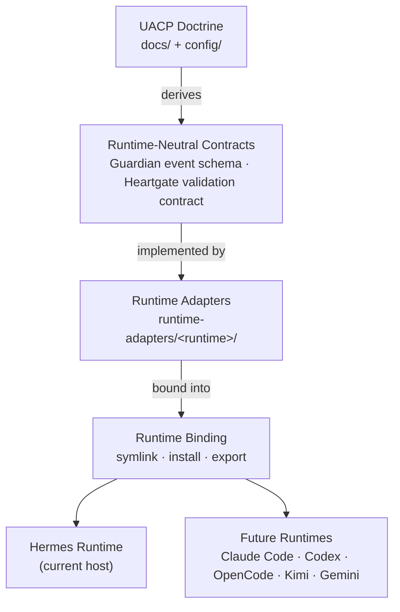

# Runtime Porting And Version Control

This document defines UACP's runtime adapter ownership policy, version-control binding, and binding sequence for all current and future runtime targets.

## Purpose

UACP is the central Git-controlled source of truth for governed runtime adapter behavior. Runtime repositories such as Hermes Agent are downstream targets, not the long-term authority root for UACP-owned plugins, hooks, policy packs, or adapter source.

## Authority Model

```text
UACP doctrine/config/state
  -> runtime-neutral contracts
  -> runtime-adapters/<runtime>/...
  -> runtime-specific plugin/hook/config binding
  -> symlink/install/export into Hermes, OpenCode, Claude Code, Codex, Kimi, Gemini, or future runtimes
```



Runtime behavior must derive from UACP docs/config and must not become a hidden source of truth. Hermes is the first target runtime, not the conceptual boundary.

## Repository Policy

- `UACP_ROOT` owns governed doctrine, configs, plans, verification, audit artifacts, runtime contracts, and runtime adapters.
- `UACP_ROOT/main` represents stable reviewed UACP authority state.
- Active governed runtime-porting work uses local branches/worktrees named `uacp/<run-id>/<topic>`.
- A private remote is required for real backup; local Git alone is version history, not backup.
- Pushes to any remote are external side effects and require explicit operator confirmation.

## Hermes Runtime Adapter Policy

UACP-owned Hermes plugin source should live under `runtime-adapters/hermes/plugins/<plugin-name>/` and be consumed through `HERMES_ROOT/plugins/<plugin-name>` symlink bindings. Hermes Agent may temporarily contain duplicate plugin copies while proving the user-plugin binding, but UACP-specific plugin source should move out of the Hermes local patch after discovery and behavior tests pass.

## Binding Sequence

1. Ground-truth runtime discovery with a non-destructive symlink probe.
2. Copy/import candidate adapter source under `runtime-adapters/hermes/plugins/`.
3. Bind selected adapters into `HERMES_ROOT/plugins/` by symlink or equivalent runtime binding.
4. Verify manifest discovery, module loading, hook/tool registration, and affected runtime behavior.
5. Only then reduce duplicated Hermes Agent plugin source.
6. Record rollback commands and commit references for both UACP and runtime repos.

## Rollback Requirements

For a symlink binding, rollback must be executable without touching UACP source: remove the `HERMES_ROOT/plugins/<plugin-name>` symlink. If the Hermes Agent bundled copy was already removed, restore it from the local Hermes patch commit or upstream branch before restarting Hermes.

## Future Runtime Targets

UACP is designed to support multiple runtimes. The following runtimes are planned for future adapter implementations. Each requires:

- adapter source under `runtime-adapters/<runtime>/`
- binding registered in `config/uacp.toml [runtime_bindings]`
- verification artifact under `verification/`
- environment documented in the adapter source directory

| Runtime | Source path | Binding status |
|---|---|---|
| Hermes | `runtime-adapters/hermes/` | Live (user-plugin symlinks) |
| Claude Code | `runtime-adapters/claude-code/` | Planned |
| Codex | `runtime-adapters/codex/` | Planned |
| OpenCode | `runtime-adapters/opencode/` | Planned |
| Kimi | `runtime-adapters/kimi/` | Planned |
| Gemini | `runtime-adapters/gemini/` | Planned |

For the integration contract (Guardian event schema, Heartgate validation, required hooks, required tools, binding sequence, verification checklist), see `docs/runtime/runtime-integration-guide.md`.

## Config Boundary

Sanitized Norty config templates may use a smaller config repository or Gist, but that is not UACP authority. Do not store secrets, `.env`, `auth.json`, `state.db`, sessions, logs, or private memory in Git/Gist.
